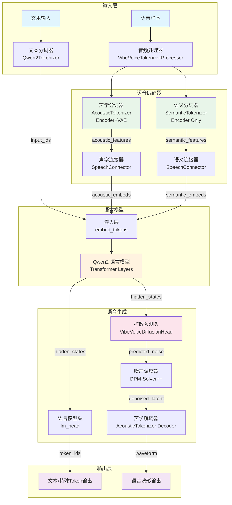
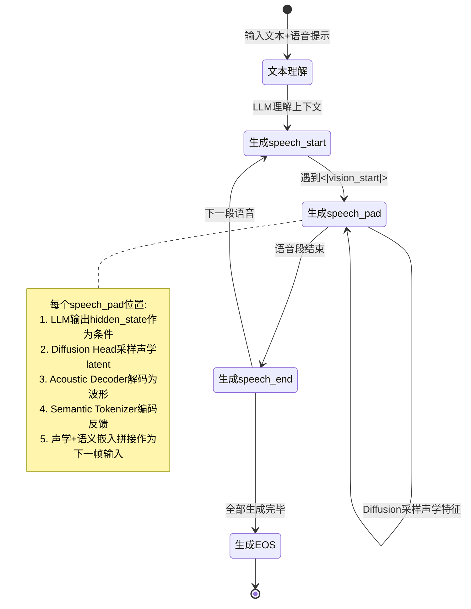
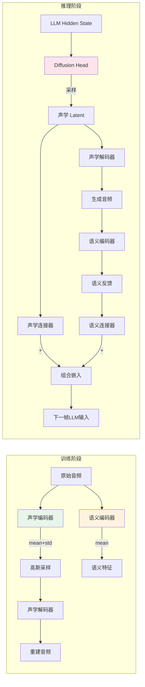
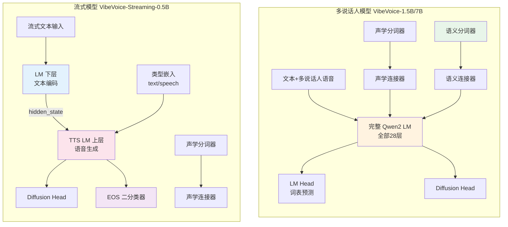
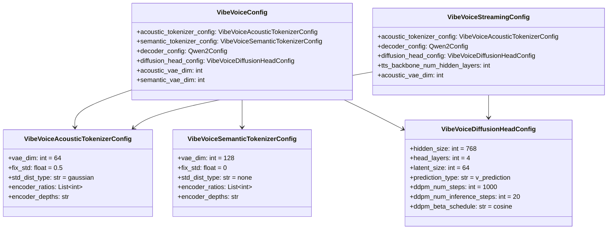

# VibeVoice 项目架构与设计理念

> 本文档基于 VibeVoice 项目源码进行深度架构分析，涵盖整体架构、核心设计理念、双分词器设计、多说话人与流式模型差异、模块化设计原则、与传统 TTS 对比以及 7.5Hz 超低帧率设计考量。

---

## 1. 项目整体架构图

VibeVoice 的核心推理流程遵循 **文本→LLM→Diffusion→语音** 的流水线设计。以下 Mermaid 图展示了多说话人模型（VibeVoice-1.5B/7B）的完整架构：



### 推理阶段的 Token 生成循环

在推理阶段，模型以自回归方式逐 Token 生成，遇到特殊 Token 时切换行为模式：



---

## 2. 核心设计理念：AR + Diffusion 混合架构

### 2.1 架构动机

VibeVoice 采用 **自回归（AR）+ 扩散（Diffusion）** 的混合架构，这是对传统纯 AR 或纯 Diffusion TTS 方案的突破性设计。其核心思想是：

- **AR（自回归）部分**：由 Qwen2 语言模型承担，负责理解文本语义、对话上下文、说话人信息，并决定"说什么"和"何时说"——即高层语义规划。
- **Diffusion（扩散）部分**：由 `VibeVoiceDiffusionHead` 承担，负责生成精细的声学细节——即"怎么说"。

这种分工让两种模型各司其职：LLM 擅长离散序列建模和长上下文理解，Diffusion 擅长连续信号的精细生成。

### 2.2 Next-Token Diffusion 框架

VibeVoice 提出的 "next-token diffusion" 框架，将扩散模型嵌入到自回归生成的循环中：

```
对于每个 speech_pad 位置:
    1. LLM 前向传播 → 得到 hidden_state（条件向量）
    2. 从高斯噪声开始，经 Diffusion Head 多步去噪 → 得到声学 latent
    3. 声学 latent 经 Acoustic Decoder 解码 → 得到音频波形
    4. 音频波形经 Semantic Tokenizer 编码 → 得到语义特征
    5. acoustic_embed + semantic_embed → 作为下一帧的输入嵌入
```

关键代码位于 `vibevoice/modular/modeling_vibevoice_inference.py` 的 `generate` 方法中（第 574-674 行），核心循环逻辑如下：

```python
# 当生成到 speech_diffusion_id 位置时
diffusion_indices = torch.arange(batch_size, device=device)[
    ~finished_tags & (next_tokens == generation_config.speech_diffusion_id)
]

if diffusion_indices.numel() > 0:
    # 1. 获取 LLM 的 hidden_state 作为条件
    positive_condition = outputs.last_hidden_state[diffusion_indices, -1, :]
    negative_condition = negative_outputs.last_hidden_state[diffusion_indices, -1, :]

    # 2. Diffusion 采样声学 latent
    speech_latent = self.sample_speech_tokens(
        positive_condition, negative_condition, cfg_scale=cfg_scale
    ).unsqueeze(1)

    # 3. 解码为音频
    scaled_latent = speech_latent / self.model.speech_scaling_factor - self.model.speech_bias_factor
    audio_chunk = self.model.acoustic_tokenizer.decode(scaled_latent, ...)

    # 4. 语义编码反馈
    semantic_features = self.model.semantic_tokenizer.encode(audio_chunk, ...).mean

    # 5. 拼接嵌入作为下一帧输入
    acoustic_embed = self.model.acoustic_connector(speech_latent)
    semantic_embed = self.model.semantic_connector(semantic_features)
    diffusion_embeds = acoustic_embed + semantic_embed
```

### 2.3 Classifier-Free Guidance（CFG）

推理时使用 CFG 提升语音质量。模型同时维护正条件（有文本上下文）和负条件（无文本上下文）两条推理路径，通过引导尺度（`cfg_scale`）控制生成质量与多样性的权衡：

```python
# sample_speech_tokens 方法中的 CFG 实现
half_eps = uncond_eps + cfg_scale * (cond_eps - uncond_eps)
```

默认 `cfg_scale=3.0`，更高的值使生成更贴合文本条件，但可能降低多样性。

---

## 3. 双分词器设计（声学 + 语义）

### 3.1 设计原因

VibeVoice 独创性地使用了 **双分词器** 设计，分别从不同维度编码语音信息：

| 特性 | 声学分词器（Acoustic Tokenizer） | 语义分词器（Semantic Tokenizer） |
|------|------|------|
| 模型类型 | Encoder + Decoder（VAE） | Encoder Only |
| 潜在维度 | 64 维（`vae_dim=64`） | 128 维（`vae_dim=128`） |
| 采样方式 | 高斯采样（`std_dist_type='gaussian'`, `fix_std=0.5`） | 确定性（`std_dist_type='none'`, `fix_std=0`） |
| 功能 | 编码→解码（可重建波形） | 仅编码（提取语义特征） |
| 作用 | 提供可解码的声学表示 | 提供高层语义信息反馈给 LLM |
| 配置类 | `VibeVoiceAcousticTokenizerConfig` | `VibeVoiceSemanticTokenizerConfig` |
| 模型类 | `VibeVoiceAcousticTokenizerModel` | `VibeVoiceSemanticTokenizerModel` |

### 3.2 双分词器的协同工作

双分词器的设计解决了一个核心矛盾：**声学质量和语义一致性难以同时优化**。



**声学分词器**负责可逆的音频压缩与重建，其 VAE 结构允许通过采样引入随机性，从而在 Diffusion 过程中生成多样化的声学细节。

**语义分词器**仅编码不解码，提取的是语音的高层语义特征（类似 HuBERT/WavLM 的思想），这些特征作为"自我反馈"信号回传给 LLM，使 LLM 在生成下一帧时能"听到"自己刚刚生成的语音内容，从而保持语义连贯性。

### 3.3 优势分析

1. **解耦声学与语义**：声学分词器专注波形重建质量，语义分词器专注高层信息提取，互不干扰。
2. **闭环反馈**：语义分词器将生成音频的语义信息反馈给 LLM，形成"听-说"闭环，显著提升长对话的连贯性。
3. **灵活的采样策略**：声学分词器使用高斯采样（`fix_std=0.5`），语义分词器不采样（`fix_std=0`），确保语义反馈的确定性。
4. **独立缩放**：两个分词器的输出通过独立的 `SpeechConnector` 映射到 LLM 的隐藏空间，允许分别调整声学和语义信息的权重。

### 3.4 SpeechConnector 设计

两个连接器结构相同但参数独立：

```python
class SpeechConnector(nn.Module):
    def __init__(self, input_dim, output_dim):
        super().__init__()
        self.fc1 = nn.Linear(input_dim, output_dim)   # 投影到 LM 空间
        self.norm = LlamaRMSNorm(output_dim, eps=1e-6) # RMS 归一化
        self.fc2 = nn.Linear(output_dim, output_dim)   # 二次变换
```

声学连接器：`input_dim=64`（acoustic_vae_dim）→ `output_dim=hidden_size`
语义连接器：`input_dim=128`（semantic_vae_dim）→ `output_dim=hidden_size`

两个连接器的输出在推理时**相加**融合：`diffusion_embeds = acoustic_embed + semantic_embed`

---

## 4. 多说话人 vs 流式模型的架构差异

VibeVoice 提供两种架构变体：**多说话人模型**（1.5B/7B）和**流式模型**（0.5B），它们在设计目标和架构上有显著差异。

### 4.1 架构对比总览



### 4.2 详细对比

| 特性 | 多说话人模型 | 流式模型 |
|------|------|------|
| **模型规模** | 1.5B（64K 上下文）/ 7B（32K 上下文） | 0.5B（8K 上下文） |
| **LM 架构** | 完整 Qwen2，所有层统一处理 | 分层：下层文本编码 + 上层 TTS 生成 |
| **语义分词器** | ✅ 有（128 维） | ❌ 无 |
| **LM Head** | ✅ 有（词表大小预测） | ❌ 无（无文本生成需求） |
| **EOS 检测** | 通过 Token 预测（`eos_token_id`） | 二分类器（`BinaryClassifier`） |
| **类型嵌入** | 无 | ✅ 有（`tts_input_types`，区分文本/语音） |
| **上下文长度** | 64K / 32K | 8K |
| **说话人数量** | 最多 4 人 | 单人 |
| **生成方式** | 逐 Token 自回归 | 窗口式（5 文本 + 6 语音帧交替） |
| **配置类** | `VibeVoiceConfig` | `VibeVoiceStreamingConfig` |
| **模型类** | `VibeVoiceModel` | `VibeVoiceStreamingModel` |
| **推理类** | `VibeVoiceForConditionalGenerationInference` | `VibeVoiceStreamingForConditionalGenerationInference` |

### 4.3 流式模型的分层架构

流式模型最核心的设计是将 Qwen2 的 Transformer 层分为两部分：

```python
# vibevoice/modular/modeling_vibevoice_streaming.py

# 下层：文本编码（num_hidden_layers - tts_backbone_num_hidden_layers 层）
lm_config.num_hidden_layers = lm_backbone_num_hidden_layers
self.language_model = AutoModel.from_config(lm_config)
self.language_model.norm = nn.Identity()  # 下层不需要最终归一化

# 上层：TTS 生成（tts_backbone_num_hidden_layers 层，默认20层）
tts_lm_config.num_hidden_layers = config.tts_backbone_num_hidden_layers
self.tts_language_model = AutoModel.from_config(tts_lm_config)

# 类型嵌入：标记当前输入是文本还是语音
self.tts_input_types = nn.Embedding(num_embeddings=2, embedding_dim=hidden_size)
```

这种分层设计使得：
- **下层 LM** 可以独立预填充文本上下文，无需等待语音生成
- **上层 TTS LM** 接收下层的 hidden_state，结合类型嵌入，专注于语音生成
- 两个子模型可以独立使用 KV Cache，实现真正的流式推理

### 4.4 流式模型的窗口生成机制

流式模型采用固定窗口的文本-语音交替生成策略：

```python
TTS_TEXT_WINDOW_SIZE = 5    # 每次处理 5 个文本 Token
TTS_SPEECH_WINDOW_SIZE = 6  # 每次生成 6 帧语音
```

生成循环：
1. 输入 5 个文本 Token → LM 下层编码 → TTS LM 上层处理
2. 生成 6 帧语音 latent（每帧一次 Diffusion 采样）
3. 每帧语音后检查 EOS 二分类器：`sigmoid(logit) > 0.5` 则停止
4. 回到步骤 1，继续下一窗口

### 4.5 流式模型的 EOS 检测

多说话人模型通过 LLM 的 Token 预测来检测结束（生成 `eos_token_id`），而流式模型使用专门的二分类器：

```python
class BinaryClassifier(nn.Module):
    def __init__(self, hidden_size):
        super().__init__()
        self.fc1 = nn.Linear(hidden_size, hidden_size)
        self.fc2 = nn.Linear(hidden_size, 1)

    def forward(self, x):
        x = torch.relu(self.fc1(x))
        x = self.fc2(x)
        return x
```

在每帧语音生成后，对 TTS LM 的最后一层 hidden_state 进行二分类判断，`sigmoid(logit) > 0.5` 时认为语音段结束。这种设计避免了流式模型对完整词表的依赖，使模型更轻量。

---

## 5. 模块化设计原则

VibeVoice 的代码架构严格遵循**配置、模型、处理器、调度器分离**的原则，体现了高度模块化的工程设计。

### 5.1 项目目录结构

```
vibevoice/
├── configs/                          # 模型配置文件
│   ├── qwen2.5_1.5b_64k.json        # 1.5B 模型配置（64K 上下文）
│   └── qwen2.5_7b_32k.json          # 7B 模型配置（32K 上下文）
├── modular/                          # 核心模型模块
│   ├── configuration_vibevoice.py    # 多说话人模型配置类
│   ├── configuration_vibevoice_streaming.py  # 流式模型配置类
│   ├── modeling_vibevoice.py         # 多说话人模型（训练）
│   ├── modeling_vibevoice_inference.py  # 多说话人模型（推理）
│   ├── modeling_vibevoice_streaming.py  # 流式模型（训练）
│   ├── modeling_vibevoice_streaming_inference.py  # 流式模型（推理）
│   ├── modeling_vibevoice_asr.py     # ASR 模型
│   ├── modular_vibevoice_tokenizer.py   # 声学/语义分词器实现
│   ├── modular_vibevoice_diffusion_head.py  # Diffusion Head 实现
│   ├── modular_vibevoice_text_tokenizer.py  # 文本分词器
│   ├── lora_loading.py              # LoRA 加载支持
│   └── streamer.py                  # 音频流式输出
├── processor/                        # 数据处理器
│   ├── vibevoice_processor.py       # 主处理器（文本+音频统一处理）
│   ├── vibevoice_tokenizer_processor.py  # 音频处理器
│   ├── vibevoice_streaming_processor.py  # 流式处理器
│   └── vibevoice_asr_processor.py   # ASR 处理器
├── schedule/                         # 采样调度器
│   ├── dpm_solver.py                # DPM-Solver++ 噪声调度器
│   └── timestep_sampler.py          # 时间步采样器
├── finetune/                         # 微调脚本
│   ├── train_vibevoice.py           # 训练入口
│   └── data_vibevoice.py            # 数据处理
└── scripts/                          # 工具脚本
    ├── convert_nnscaler_checkpoint_to_transformers.py
    └── merge_vibevoice_models.py
```

### 5.2 配置与模型分离

VibeVoice 使用 HuggingFace 的 `PretrainedConfig` 体系，将配置完全从模型代码中解耦：



配置类使用 `is_composition = True` 和 `sub_configs` 字典实现嵌套配置的自动解析，支持从 JSON 文件或字典直接实例化。

### 5.3 训练与推理模型分离

VibeVoice 将训练和推理模型分为不同的类，这是关键的架构决策：

| 文件 | 类名 | 用途 |
|------|------|------|
| `modeling_vibevoice.py` | `VibeVoiceForConditionalGeneration` | 训练（计算 CE Loss + Diffusion Loss） |
| `modeling_vibevoice_inference.py` | `VibeVoiceForConditionalGenerationInference` | 推理（自回归生成 + Diffusion 采样） |
| `modeling_vibevoice_streaming.py` | `VibeVoiceStreamingModel` | 流式训练 |
| `modeling_vibevoice_streaming_inference.py` | `VibeVoiceStreamingForConditionalGenerationInference` | 流式推理 |

这种分离的好处：
- **训练模型**可以包含损失计算、梯度检查点等训练专用逻辑
- **推理模型**可以优化为纯前向传播，集成 `GenerationMixin`，支持 KV Cache
- 两者共享底层 `VibeVoiceModel`，权重兼容

### 5.4 处理器层

`VibeVoiceProcessor` 是用户与模型交互的主要接口，封装了文本分词和音频处理的完整流程：

```python
class VibeVoiceProcessor:
    def __init__(self, tokenizer, audio_processor, 
                 speech_tok_compress_ratio=3200, db_normalize=True):
        ...
```

核心职责：
1. **脚本解析**：将 "Speaker 1: 你好\nSpeaker 2: 嗨" 格式解析为结构化数据
2. **语音提示构建**：为每个说话人创建语音提示 Token 序列（`<|vision_start|> + pad * N + <|vision_end|>`）
3. **音频预处理**：加载、归一化、计算压缩后的帧数
4. **批量编码**：统一 padding 和 attention mask 生成

### 5.5 调度器层

`DPMSolverMultistepScheduler` 从 diffusers 库适配而来，负责 Diffusion 采样的时间步调度：

- 训练时 1000 步（`ddpm_num_steps=1000`），推理时 20 步（`ddpm_num_inference_steps=20`）
- 使用 cosine 噪声调度（`ddpm_beta_schedule='cosine'`）
- 采用 v-prediction 预测类型（`prediction_type='v_prediction'`），对高信噪比区域更稳定
- 支持 DPM-Solver++ 二阶/三阶求解器，大幅减少推理步数

---

## 6. 与传统 TTS 系统的对比

### 6.1 架构范式对比

| 维度 | 传统 TTS（Tacotron/FastSpeech/VITS） | VibeVoice |
|------|------|------|
| **核心范式** | 文本→频谱→声码器 | 文本→LLM→Diffusion→Tokenizer解码 |
| **文本理解** | 音素/字符级别编码 | LLM 深度语义理解（Qwen2） |
| **声学生成** | 确定性映射或单步 VAE | 多步 Diffusion 采样 |
| **上下文建模** | 有限（通常句子级别） | 超长上下文（64K Token，约 90 分钟） |
| **多说话人** | 说话人嵌入/参考编码 | 语音提示 + LLM 上下文理解 |
| **语音克隆** | 需要微调或专门编码器 | 零样本：提供几秒参考音频即可 |
| **对话建模** | 无（逐句生成） | 原生支持多说话人对话 |
| **流式能力** | 需要专门设计 | 流式模型原生支持 |

### 6.2 关键技术差异

**1. 连续表示 vs 离散 Token**

传统 TTS 通常使用离散语音 Token（如 EnCodec 的 RVQ 码本），而 VibeVoice 使用**连续语音 Tokenizer**：

- 优势：避免了离散化带来的信息损失，连续空间更适合 Diffusion 建模
- 声学 Tokenizer 输出 64 维连续向量，语义 Tokenizer 输出 128 维连续向量
- 使用 VAE 重参数化（`fix_std=0.5`）而非离散量化

**2. 超低帧率 vs 高帧率**

传统 TTS 通常以 50-75 Hz 的帧率生成声学特征，而 VibeVoice 以 **7.5 Hz** 的超低帧率运行（详见第 7 节），这极大地降低了 LLM 的序列长度压力。

**3. 语义反馈闭环**

传统 TTS 是开环系统（文本→语音，无反馈），VibeVoice 通过语义分词器实现了闭环：生成的语音被编码为语义特征反馈给 LLM，使模型能"感知"自己的输出。

**4. 统一的语言模型接口**

VibeVoice 将语音生成统一为语言模型的 Token 生成问题，使用特殊 Token（`<|vision_start|>`、`<|vision_pad|>`、`<|vision_end|>`）标记语音段，使 TTS 成为 LLM 的一种"模态扩展"。

### 6.3 性能对比

| 指标 | VITS | Bark | VibeVoice |
|------|------|------|------|
| 最大音频时长 | 数十秒 | ~30秒 | 90 分钟 |
| 说话人数量 | 1（需微调多说话人） | 有限预设 | 最多 4 人 |
| 零样本克隆 | 不支持 | 有限 | 支持 |
| 长对话连贯性 | 差（逐句生成） | 一般 | 优秀（LLM 上下文） |
| 流式支持 | 需改造 | 不支持 | 原生支持（Streaming 模型） |

---

## 7. 7.5Hz 超低帧率的设计考量

### 7.1 帧率计算

VibeVoice 的语音帧率由以下参数决定：

```
帧率 = 采样率 / 压缩比 = 24000 / 3200 = 7.5 Hz
```

即每秒语音仅产生 7.5 帧 Token，每帧对应约 133ms 的音频。

相关代码位于 `vibevoice/processor/vibevoice_processor.py`：

```python
class VibeVoiceProcessor:
    def __init__(self, ..., speech_tok_compress_ratio=3200, ...):
        self.speech_tok_compress_ratio = speech_tok_compress_ratio
```

以及帧数计算：

```python
vae_tok_len = math.ceil(wav.shape[0] / self.speech_tok_compress_ratio)
```

### 7.2 压缩比 3200 的来源

压缩比 3200 由声学分词器编码器的下采样比率乘积决定：

```python
encoder_ratios = [8, 5, 5, 4, 2, 2]
# 总压缩比 = 8 × 5 × 5 × 4 × 2 × 2 = 3200
```

每一层下采样将时间维度缩小对应倍数，6 层累计压缩 3200 倍。

### 7.3 超低帧率的设计优势

**1. 极大降低 LLM 序列长度压力**

以 1 分钟语音为例：
- 50Hz 帧率：3000 帧 Token
- 7.5Hz 帧率：450 帧 Token

在 64K 上下文窗口下，7.5Hz 帧率可以容纳约 64K / 450 ≈ 142 分钟的纯语音 Token，加上文本 Token，实际可支持约 90 分钟的对话生成。

**2. 使长对话生成成为可能**

VibeVoice 的核心卖点之一是支持超长对话（最长 90 分钟，最多 4 个说话人）。如果使用传统 50Hz 帧率，1 分钟语音就需要 3000 个 Token 位置，64K 上下文仅能支持约 20 分钟，远不能满足需求。

**3. 与 LLM 推理效率的平衡**

7.5Hz 意味着 LLM 每秒只需生成 7.5 个 Token（而非传统 TTS 的 50+ 个），大幅降低了自回归生成的计算量。考虑到每个 Token 位置还需要运行 Diffusion 采样（20 步），帧率的降低直接线性减少了 Diffusion 的总计算量。

**4. 声学细节由 Diffusion 补偿**

超低帧率意味着每帧需要承载更多信息（133ms 的音频细节），这正是 Diffusion Head 的价值所在——它从 LLM 的 hidden_state 条件出发，通过多步去噪生成 64 维的精细声学 latent，再由声学解码器还原为高质量波形。

### 7.4 超低帧率的潜在挑战与应对

| 挑战 | 应对策略 |
|------|------|
| 帧间过渡可能不平滑 | 声学解码器使用因果卷积 + 流式缓存，确保帧间连续性 |
| 每帧信息密度高 | Diffusion Head 的 4 层 AdaLN-FFN 网络提供足够的建模能力 |
| 时间分辨率低可能丢失细节 | 语义分词器提供帧级别的语义反馈，弥补时间分辨率的不足 |
| 流式延迟较高 | 流式模型使用窗口生成（6 帧/窗 ≈ 800ms），平衡延迟与质量 |

### 7.5 帧率与模型配置的关系

| 模型 | 上下文长度 | 纯语音容量 | 实际对话容量 |
|------|------|------|------|
| VibeVoice-1.5B | 64K Token | ~142 分钟 | ~90 分钟（含文本） |
| VibeVoice-7B | 32K Token | ~71 分钟 | ~45 分钟（含文本） |
| VibeVoice-Streaming-0.5B | 8K Token | ~18 分钟 | 实时流式（无需全部缓存） |

---

## 附录：关键文件索引

| 文件路径 | 说明 |
|------|------|
| `vibevoice/modular/modeling_vibevoice.py` | 多说话人模型定义（训练） |
| `vibevoice/modular/modeling_vibevoice_inference.py` | 多说话人推理引擎 |
| `vibevoice/modular/modeling_vibevoice_streaming.py` | 流式模型定义（训练） |
| `vibevoice/modular/modeling_vibevoice_streaming_inference.py` | 流式推理引擎 |
| `vibevoice/modular/configuration_vibevoice.py` | 所有配置类定义 |
| `vibevoice/modular/configuration_vibevoice_streaming.py` | 流式模型配置 |
| `vibevoice/modular/modular_vibevoice_tokenizer.py` | 声学/语义分词器实现 |
| `vibevoice/modular/modular_vibevoice_diffusion_head.py` | Diffusion Head 实现 |
| `vibevoice/modular/modular_vibevoice_text_tokenizer.py` | 文本分词器（Qwen2 + 语音特殊 Token） |
| `vibevoice/modular/streamer.py` | 音频流式输出（同步/异步） |
| `vibevoice/processor/vibevoice_processor.py` | 主数据处理器 |
| `vibevoice/schedule/dpm_solver.py` | DPM-Solver++ 噪声调度器 |
| `vibevoice/configs/qwen2.5_1.5b_64k.json` | 1.5B 模型完整配置 |
| `vibevoice/configs/qwen2.5_7b_32k.json` | 7B 模型完整配置 |
