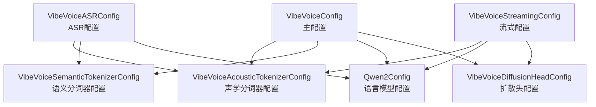

# VibeVoice 配置系统详解

## 一、配置系统整体架构

VibeVoice 采用了 **组合式配置模式**（`is_composition=True`），这是 HuggingFace Transformers 框架中用于管理复杂多组件模型的设计模式。通过将大配置拆分为多个独立的子配置，既保证了灵活性，又避免了单一配置文件过大的问题。



配置文件位置：
- [vibevoice/modular/configuration_vibevoice.py](file:///workspace/vibevoice/modular/configuration_vibevoice.py)
- [vibevoice/modular/configuration_vibevoice_streaming.py](file:///workspace/vibevoice/modular/configuration_vibevoice_streaming.py)

---

## 二、VibeVoiceConfig 主配置详解

### 2.1 核心属性

```python
class VibeVoiceConfig(PretrainedConfig):
    model_type = "vibevoice"
    is_composition = True  # 关键：标识为组合配置
```

`is_composition=True` 是该配置系统的核心特性，它告诉 Transformers 框架这个配置由多个子配置组成。

### 2.2 子配置映射

```python
sub_configs = {
    "acoustic_tokenizer_config": VibeVoiceAcousticTokenizerConfig,
    "semantic_tokenizer_config": VibeVoiceSemanticTokenizerConfig,
    "decoder_config": Qwen2Config,
    "diffusion_head_config": VibeVoiceDiffusionHeadConfig,
}
```

### 2.3 子配置实例化逻辑

在 [`__init__`](file:///workspace/vibevoice/modular/configuration_vibevoice.py#L185-L241) 方法中，实现了三种子配置初始化方式：

1. **默认初始化**：参数为 `None` 时，使用默认配置
2. **字典初始化**：参数为 `dict` 时，转换为对应配置类实例
3. **实例直接传递**：参数已为配置类实例时，直接使用

以声学分词器配置为例：

```python
if acoustic_tokenizer_config is None:
    self.acoustic_tokenizer_config = self.sub_configs["acoustic_tokenizer_config"]()
elif isinstance(acoustic_tokenizer_config, dict):
    acoustic_tokenizer_config["model_type"] = "vibevoice_acoustic_tokenizer"
    self.acoustic_tokenizer_config = self.sub_configs["acoustic_tokenizer_config"](**acoustic_tokenizer_config)
elif isinstance(acoustic_tokenizer_config, VibeVoiceAcousticTokenizerConfig):
    self.acoustic_tokenizer_config = acoustic_tokenizer_config
```

### 2.4 张量并行计划

为支持分布式训练，配置了基础模型的张量并行策略：

```python
base_model_tp_plan = {
    "layers.*.self_attn.q_proj": "colwise",
    "layers.*.self_attn.k_proj": "colwise",
    "layers.*.self_attn.v_proj": "colwise",
    "layers.*.self_attn.o_proj": "rowwise",
    "layers.*.mlp.gate_proj": "colwise",
    "layers.*.mlp.up_proj": "colwise",
    "layers.*.mlp.down_proj": "rowwise",
}
```

---

## 三、声学分词器配置详解

### 3.1 基本参数

| 参数 | 默认值 | 说明 |
|------|--------|------|
| `channels` | 1 | 音频通道数（单声道） |
| `causal` | True | 是否使用因果卷积（流式推理需要） |
| `vae_dim` | 64 | VAE 潜在空间维度 |
| `fix_std` | 0.5 | VAE 重参数化的固定标准差 |
| `std_dist_type` | 'gaussian' | 标准差分布类型 |

### 3.2 卷积模块参数

```python
mixer_layer: str = 'depthwise_conv'      # 混合层类型
conv_norm: str = 'none'                  # 卷积归一化类型
pad_mode: str = 'constant'               # 填充模式
layernorm: str = 'RMSNorm'               # 层归一化类型
layernorm_eps: float = 1e-5              # 归一化 epsilon
layer_scale_init_value: float = 1e-6     # LayerScale 初始值
```

### 3.3 编码器特定参数

```python
encoder_n_filters: int = 32              # 初始过滤器数量
encoder_ratios: List[int] = [8,5,5,4,2,2] # 每级下采样比例
encoder_depths: str = "3-3-3-3-3-3-8"    # 每级 Block1D 数量
```

**下采样比例计算**：`8*5*5*4*2*2 = 3200`，配合 24kHz 采样率，得到帧率：`24000 / 3200 = 7.5 Hz`

### 3.4 解码器特定参数

```python
decoder_ratios: Optional[List[int]] = None  # 默认与编码器相同
decoder_n_filters: int = 32
decoder_depths: Optional[str] = None
```

---

## 四、语义分词器配置详解

语义分词器配置与声学分词器配置非常相似，主要差异在于：

| 参数 | 声学分词器 | 语义分词器 | 说明 |
|------|-----------|-----------|------|
| `vae_dim` | 64 | 128 | 语义分词器使用更大的潜在空间 |
| `fix_std` | 0.5 | 0 | 语义分词器不使用重参数化采样 |
| `std_dist_type` | 'gaussian' | 'none' | 无语义分词器无标准差分布 |
| 解码器 | 有 | 无 | 语义分词器仅需要编码器 |

语义分词器仅用于特征提取，不需要重构音频，因此无需解码器。

---

## 五、扩散头配置详解

### 5.1 网络结构参数

```python
hidden_size=768              # 隐藏层维度
head_layers=4                # HeadLayer 层数
head_ffn_ratio=3.0           # FFN 维度比例
rms_norm_eps=1e-5            # RMSNorm epsilon
latent_size=64               # 潜在空间大小（与声学 VAE dim 一致）
speech_vae_dim=None          # 语音 VAE 维度
```

### 5.2 扩散参数

```python
prediction_type="v_prediction"  # 预测类型：v_prediction
diffusion_type="ddpm"           # 扩散类型：DDPM
ddpm_num_steps=1000             # 训练步数
ddpm_num_inference_steps=20     # 推理步数
ddpm_beta_schedule="cosine"     # Beta 调度：余弦
ddpm_batch_mul=4                # 批量倍数（用于加速推理）
```

**v_prediction 的优势**：相比 epsilon 预测，v_prediction 在高噪声水平下更稳定，训练更容易收敛。

---

## 六、流式模型配置详解

### 6.1 与多说话人配置的差异

| 特性 | 多说话人 | 流式 |
|------|---------|------|
| 语义分词器 | ✅ 有 | ❌ 无 |
| 语言模型 | 完整 Qwen2 | 分层 Qwen2 |
| 实时优化 | ❌ | ✅ |

### 6.2 分层语言模型配置

```python
tts_backbone_num_hidden_layers=20  # 上层 TTS 专用层数
```

流式模型将 Qwen2 分为两部分：
- **下层**：仅用于文本编码
- **上层（20层）**：用于文本编码 + 语音生成

### 6.3 配置文件位置

[vibevoice/modular/configuration_vibevoice_streaming.py](file:///workspace/vibevoice/modular/configuration_vibevoice_streaming.py)

---

## 七、ASR 配置详解

### 7.1 子配置组成

```python
sub_configs = {
    "acoustic_tokenizer_config": VibeVoiceAcousticTokenizerConfig,
    "semantic_tokenizer_config": VibeVoiceSemanticTokenizerConfig,
    "decoder_config": Qwen2Config,
}
```

ASR 模型不需要扩散头配置。

### 7.2 兼容性属性

为了与 Transformers 生成框架兼容，ASR 配置提供了代理属性：

```python
@property
def vocab_size(self):
    return self.decoder_config.vocab_size

@property
def num_attention_heads(self):
    return self.decoder_config.num_attention_heads

@property
def hidden_size(self):
    return self.decoder_config.hidden_size
```

这些属性将查询转发给 `decoder_config`，使 ASR 模型可以直接使用 HuggingFace 的 `generate()` 方法。

---

## 八、JSON 配置文件结构

### 8.1 示例配置文件

[vibevoice/configs/qwen2.5_1.5b_64k.json](file:///workspace/vibevoice/configs/qwen2.5_1.5b_64k.json)

### 8.2 配置层级结构

```json
{
  "model_type": "vibepod",
  "torch_dtype": "bfloat16",
  "acoustic_vae_dim": 64,
  "semantic_vae_dim": 128,
  
  "acoustic_tokenizer_config": { ... },
  "semantic_tokenizer_config": { ... },
  "decoder_config": { ... },
  "diffusion_head_config": { ... }
}
```

### 8.3 Qwen2 1.5B 配置详情

```json
"decoder_config": {
  "hidden_size": 1536,
  "intermediate_size": 8960,
  "num_hidden_layers": 28,
  "num_attention_heads": 12,
  "num_key_value_heads": 2,
  "max_position_embeddings": 65536,
  "vocab_size": 151936,
  "torch_dtype": "bfloat16"
}
```

- **28层** Transformer
- **12个注意力头**，**2个KV头**（GQA）
- **64k上下文**长度
- **bfloat16** 精度

---

## 九、配置使用最佳实践

### 9.1 加载预训练配置

```python
from vibevoice.modular import VibeVoiceConfig

# 方式1：从预训练模型加载
config = VibeVoiceConfig.from_pretrained("vibevoice/VibeVoice-1.5B")

# 方式2：从 JSON 文件加载
config = VibeVoiceConfig.from_json_file("vibevoice/configs/qwen2.5_1.5b_64k.json")
```

### 9.2 修改子配置

```python
# 修改扩散头推理步数
config.diffusion_head_config.ddpm_num_inference_steps = 10

# 修改声学分词器为非因果（非流式）
config.acoustic_tokenizer_config.causal = False
```

### 9.3 创建自定义配置

```python
from vibevoice.modular import (
    VibeVoiceConfig,
    VibeVoiceAcousticTokenizerConfig,
    VibeVoiceDiffusionHeadConfig
)

# 创建自定义子配置
acoustic_config = VibeVoiceAcousticTokenizerConfig(
    causal=True,
    vae_dim=64
)

diffusion_config = VibeVoiceDiffusionHeadConfig(
    ddpm_num_inference_steps=5,  # 更快的推理
    head_layers=2
)

# 创建主配置
config = VibeVoiceConfig(
    acoustic_tokenizer_config=acoustic_config,
    diffusion_head_config=diffusion_config
)
```

---

## 十、设计理念总结

### 10.1 组合式配置的优势

1. **模块化**：每个子组件独立配置，易于理解和修改
2. **复用性**：子配置可在不同模型（TTS/ASR/流式）间共享
3. **可扩展性**：添加新组件只需新增子配置类
4. **兼容性**：完全兼容 HuggingFace Transformers 生态

### 10.2 参数设计原则

- **默认值合理**：大多数参数无需修改即可使用
- **类型安全**：使用 Python 类型注解
- **文档完善**：每个参数都有清晰的用途说明
- **向后兼容**：通过 `**kwargs` 接收未知参数
