# VibeVoice 语音分词器详解

> 源码路径：`/workspace/vibevoice/modular/modular_vibevoice_tokenizer.py`（共 1195 行）
> 配置路径：`/workspace/vibevoice/modular/configuration_vibevoice.py`

---

## 目录

1. [整体架构概览](#1-整体架构概览)
2. [VibeVoiceAcousticTokenizerModel 声学分词器](#2-vibevoiceacoustictokenizermodel-声学分词器)
3. [VibeVoiceSemanticTokenizerModel 语义分词器](#3-vibevoicesemantictokenizermodel-语义分词器)
4. [基础卷积模块详解](#4-基础卷积模块详解)
5. [VibeVoiceTokenizerStreamingCache 流式缓存系统](#5-vibevoicetokenizerstreamingcache-流式缓存系统)
6. [VibeVoiceTokenizerEncoderOutput 编码器输出与采样逻辑](#6-vibevoicetokenizerencoderoutput-编码器输出与采样逻辑)

---

## 1. 整体架构概览

VibeVoice 语音分词器体系包含两种分词器模型，均基于多阶段下采样 + ConvNeXt-style Block1D 的卷积架构：

| 分词器 | 类型 | 编码器 | 解码器 | 采样方式 | 默认 `vae_dim` |
|--------|------|--------|--------|----------|----------------|
| **VibeVoiceAcousticTokenizerModel** | 声学分词器 | ✅ | ✅ | fix / gaussian | 64 |
| **VibeVoiceSemanticTokenizerModel** | 语义分词器 | ✅ | ❌ | none（确定性） | 128 |

两者共享相同的编码器架构（`TokenizerEncoder`），但语义分词器没有解码器，仅提取语义特征。

### 整体架构 Mermaid 图

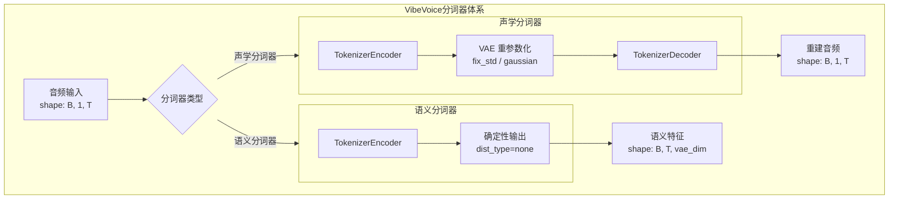

---

## 2. VibeVoiceAcousticTokenizerModel 声学分词器

**源码位置**：`modular_vibevoice_tokenizer.py` 第 1002–1115 行

声学分词器是一个完整的 VAE（变分自编码器）模型，包含编码器和解码器，用于将音频信号编码为连续潜在表示，并可从潜在表示重建音频。

### 2.1 类定义与配置

```python
class VibeVoiceAcousticTokenizerModel(PreTrainedModel):  # 第 1002 行
    config_class = VibeVoiceAcousticTokenizerConfig
    base_model_prefix = "vibevoice_acoustic_tokenizer"
    _no_split_modules = ["TokenizerEncoder", "TokenizerDecoder"]
```

**默认配置**（来自 `configuration_vibevoice.py` 第 13–74 行）：

| 参数 | 默认值 | 说明 |
|------|--------|------|
| `channels` | 1 | 输入音频通道数（单声道） |
| `causal` | True | 是否使用因果卷积 |
| `vae_dim` | 64 | 潜在空间维度 |
| `fix_std` | 0.5 | 固定标准差 |
| `std_dist_type` | 'gaussian' | 采样分布类型 |
| `mixer_layer` | 'depthwise_conv' | Block1D 中的 mixer 类型 |
| `conv_norm` | 'none' | 卷积归一化方式 |
| `pad_mode` | 'constant' | 填充模式 |
| `layernorm` | 'RMSNorm' | 归一化类型 |
| `layer_scale_init_value` | 1e-6 | LayerScale 初始值 |
| `encoder_n_filters` | 32 | 编码器基础滤波器数 |
| `encoder_ratios` | [8,5,5,4,2,2] | 编码器下采样比率 |
| `encoder_depths` | "3-3-3-3-3-3-8" | 编码器各阶段 Block1D 深度 |
| `decoder_n_filters` | 32 | 解码器基础滤波器数 |
| `disable_last_norm` | True | 是否禁用最后归一化层 |

### 2.2 Encoder 架构：TokenizerEncoder

**源码位置**：`modular_vibevoice_tokenizer.py` 第 687–813 行

编码器采用多阶段下采样架构，灵感来自 ConvNeXt 的分层设计。

#### 2.2.1 架构总览

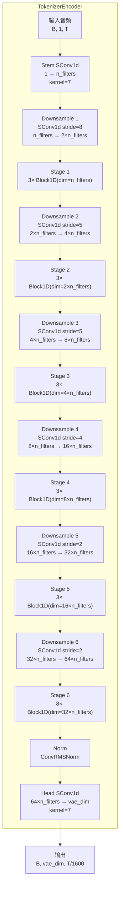

#### 2.2.2 多阶段下采样详解

编码器的下采样比率 `ratios=[8,5,5,4,2,2]`（第 701 行，注意在 `TokenizerEncoder.__init__` 中被 `reversed` 为 `[2,2,4,5,5,8]`），总下采样因子为：

$$\text{hop\_length} = 8 \times 5 \times 5 \times 4 \times 2 \times 2 = 1600$$

即每 1600 个音频采样点压缩为 1 个潜在帧。

**通道数变化**（以 `n_filters=32` 为例）：

| 阶段 | 下采样比率 | 输入通道 | 输出通道 | Block1D 深度 |
|------|-----------|---------|---------|-------------|
| Stem | — | 1 | 32 | — |
| Stage 0 | 2 | 32 | 64 | 3 |
| Stage 1 | 2 | 64 | 128 | 3 |
| Stage 2 | 4 | 128 | 256 | 3 |
| Stage 3 | 5 | 256 | 512 | 3 |
| Stage 4 | 5 | 512 | 1024 | 3 |
| Stage 5 | 8 | 1024 | 2048 | 8 |

> 注意：`ratios` 在 `TokenizerEncoder.__init__`（第 701 行）中被 `list(reversed(config.ratios))` 反转，所以实际下采样顺序是 `[2,2,4,5,5,8]`，即先小比率再大比率。

#### 2.2.3 下采样层实现

每个下采样层由一个 `SConv1d` 构成（第 740–743 行）：

```python
SConv1d(in_ch, out_ch, kernel_size=self.ratios[i] * 2, stride=self.ratios[i],
        causal=self.causal, pad_mode=pad_mode, norm=norm, bias=bias)
```

- `kernel_size = ratio * 2`：核大小为步幅的 2 倍，确保下采样时信息覆盖充分
- 通道数按 `n_filters * 2^i` 逐层翻倍

#### 2.2.4 Block1D 阶段

每个阶段包含 `depths[i]` 个 `Block1D` 残差块（第 758–768 行），DropPath 率从 0 线性递增到 `drop_path_rate`。

#### 2.2.5 forward_features 与 forward

```python
def forward_features(self, x, cache=None, sample_indices=None, use_cache=False, debug=False):  # 第 776 行
    for i in range(len(self.depths)):
        # 1. 下采样
        for layer in self.downsample_layers[i]:
            x = layer(x, cache=cache, ...)  # SConv1d 支持流式
        # 2. Block1D 阶段
        for block in self.stages[i]:
            # 手动展开 Block1D 以支持流式 cache 传递
            ...
    return self.norm(x)

def forward(self, x, cache=None, ...):  # 第 810 行
    x = self.forward_features(x, ...)
    x = self.head(x, ...)  # 最终投影到 vae_dim
    return x
```

关键点：`forward_features` 中手动展开了 `Block1D` 的前向计算（第 786–806 行），而非直接调用 `block(x)`，这是为了将 `cache`、`sample_indices`、`use_cache` 参数传递到内部的 `SConv1d` 层。

### 2.3 Decoder 架构：TokenizerDecoder

**源码位置**：`modular_vibevoice_tokenizer.py` 第 816–951 行

解码器是编码器的镜像结构，采用多阶段上采样将潜在表示还原为音频波形。

#### 2.3.1 架构总览

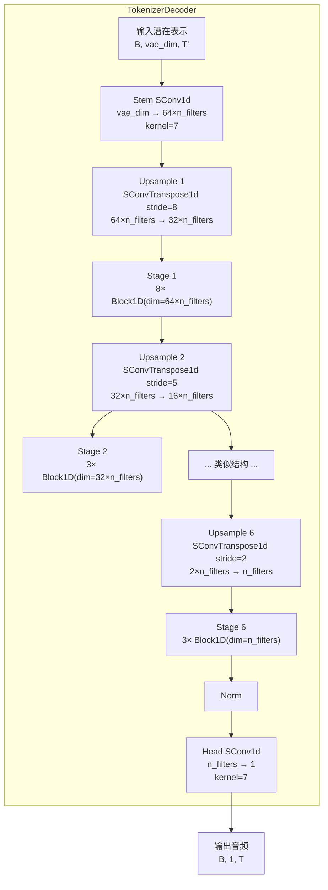

#### 2.3.2 解码器与编码器的对称关系

| 特征 | 编码器 | 解码器 |
|------|--------|--------|
| 下/上采样层 | `SConv1d` (stride > 1) | `SConvTranspose1d` (stride > 1) |
| 通道变化 | 逐层翻倍 `n_filters * 2^i` | 逐层减半 `n_filters * 2^(N-1-i)` |
| depths 顺序 | `encoder_depths` | `reversed(encoder_depths)` |
| ratios 顺序 | `reversed(config.ratios)` | `config.ratios`（原始顺序） |

**关键细节**（第 833 行注释）：

```python
# IMPORTANT CHANGE: Don't reverse depths again since they're already reversed in VibeVoiceAcousticTokenizerModel
self.depths = config.depths  # Changed from list(reversed(config.depths))
```

在 `VibeVoiceAcousticTokenizerModel.__init__`（第 1028 行）中，`decoder_depths` 默认为 `list(reversed(encoder_depths))`，因此 `TokenizerDecoder` 不再重复反转。

#### 2.3.3 上采样层实现

每个上采样层由一个 `SConvTranspose1d` 构成（第 874–879 行）：

```python
SConvTranspose1d(in_ch, out_ch,
                 kernel_size=self.ratios[i] * 2, stride=self.ratios[i],
                 norm=norm, norm_kwargs=norm_params, bias=bias,
                 causal=self.causal, trim_right_ratio=trim_right_ratio)
```

- `kernel_size = ratio * 2`：与编码器对称
- `trim_right_ratio`：因果模式下控制右侧裁剪比例，默认 1.0

### 2.4 VAE 重参数化

**源码位置**：`modular_vibevoice_tokenizer.py` 第 1014–1015 行、1082–1097 行

声学分词器使用 VAE 重参数化技巧，将编码器输出映射为高斯分布的参数，再从中采样：

```python
self.register_buffer('fix_std', torch.tensor(config.fix_std), persistent=False)  # 第 1014 行
self.std_dist_type = getattr(config, "std_dist_type", "fix")  # 第 1015 行
```

#### 2.4.1 encode 方法

```python
@torch.no_grad()
def encode(self, audio, cache=None, sample_indices=None, use_cache=False, debug=False):  # 第 1082 行
    latents = self.encoder(audio, cache=cache, ...)
    return VibeVoiceTokenizerEncoderOutput(mean=latents.permute(0, 2, 1), std=self.fix_std)
```

编码器输出 `latents` 的形状为 `[B, vae_dim, T']`，经 `permute(0, 2, 1)` 转为 `[B, T', vae_dim]` 作为均值。标准差使用固定的 `fix_std`（默认 0.5）。

#### 2.4.2 sampling 方法

```python
@torch.no_grad()
def sampling(self, encoder_output, dist_type=None):  # 第 1088 行
    dist_type = dist_type or self.std_dist_type
    if dist_type == 'fix':
        return encoder_output.sample(dist_type='fix')
    elif dist_type == 'gaussian':
        return encoder_output.sample(dist_type='gaussian')
    else:
        raise ValueError(...)
```

两种采样模式的区别详见 [第 6 节](#6-vibevoicetokenizerencoderoutput-编码器输出与采样逻辑)。

#### 2.4.3 decode 方法

```python
@torch.no_grad()
def decode(self, latents, cache=None, sample_indices=None, use_cache=False, debug=False):  # 第 1100 行
    if latents.shape[1] == self.config.vae_dim:
        pass  # 已经是 [B, vae_dim, T'] 格式
    else:
        latents = latents.permute(0, 2, 1)  # [B, T', vae_dim] → [B, vae_dim, T']
    audio = self.decoder(latents, ...)
    return audio
```

#### 2.4.4 forward 方法

```python
def forward(self, audio, cache=None, sample_indices=None, use_cache=False, debug=False):  # 第 1110 行
    encoder_output = self.encode(audio, ...)
    sampled_latents, _ = self.sampling(encoder_output)
    reconstructed = self.decode(sampled_latents, ...)
    return reconstructed, sampled_latents
```

完整的 forward 流程：**音频 → 编码 → 重参数化采样 → 解码 → 重建音频**。

### 2.5 流式推理缓存机制

声学分词器的所有卷积层（`SConv1d`、`SConvTranspose1d`）均支持流式推理。通过 `VibeVoiceTokenizerStreamingCache` 对象在 `encode`/`decode`/`forward` 中传递缓存状态。

流式推理的关键参数：
- `cache`：`VibeVoiceTokenizerStreamingCache` 实例
- `sample_indices`：每个样本的唯一索引，用于缓存键
- `use_cache`：是否启用流式模式

详细机制见 [第 5 节](#5-vibevoicetokenizerstreamingcache-流式缓存系统)。

---

## 3. VibeVoiceSemanticTokenizerModel 语义分词器

**源码位置**：`modular_vibevoice_tokenizer.py` 第 1118–1186 行

语义分词器是 Encoder-only 架构，仅提取语义特征，不包含解码器。

### 3.1 类定义与配置

```python
class VibeVoiceSemanticTokenizerModel(PreTrainedModel):  # 第 1118 行
    config_class = VibeVoiceSemanticTokenizerConfig
    base_model_prefix = "vibevoice_semantic_tokenizer"
    _no_split_modules = ["TokenizerEncoder"]
```

**默认配置**（来自 `configuration_vibevoice.py` 第 76–128 行）：

| 参数 | 默认值 | 与声学分词器的区别 |
|------|--------|-------------------|
| `vae_dim` | 128 | 声学为 64，语义更大 |
| `fix_std` | 0 | 声学为 0.5 |
| `std_dist_type` | 'none' | 声学为 'gaussian' |
| 其他参数 | 相同 | — |

### 3.2 与声学分词器的核心区别

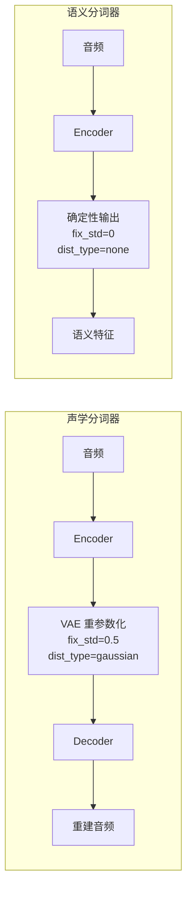

| 特征 | 声学分词器 | 语义分词器 |
|------|-----------|-----------|
| **解码器** | ✅ `TokenizerDecoder` | ❌ 无 |
| **`fix_std`** | 0.5 | 0 |
| **`std_dist_type`** | 'gaussian' | 'none' |
| **`vae_dim`** | 64 | 128 |
| **采样方式** | fix / gaussian | none（确定性，直接返回均值） |
| **输出** | 重建音频 + 采样潜在表示 | None + 确定性潜在表示 |
| **`_no_split_modules`** | Encoder + Decoder | 仅 Encoder |

### 3.3 方法实现

#### encode 方法（第 1172 行）

```python
@torch.no_grad()
def encode(self, audio, cache=None, sample_indices=None, use_cache=False, debug=False):
    latents = self.encoder(audio, ...)
    return VibeVoiceTokenizerEncoderOutput(mean=latents.permute(0, 2, 1))
    # 注意：没有传 std 参数，默认为 None
```

#### sampling 方法（第 1178 行）

```python
@torch.no_grad()
def sampling(self, encoder_output, dist_type=None):
    return encoder_output.sample(dist_type='none')  # 确定性，直接返回均值
```

#### forward 方法（第 1182 行）

```python
def forward(self, audio, cache=None, sample_indices=None, use_cache=False, debug=False):
    encoder_output = self.encode(audio, ...)
    sampled_latents, _ = self.sampling(encoder_output, dist_type='none')
    return None, sampled_latents  # 第一个返回值为 None（无解码器）
```

语义分词器的 `forward` 返回 `(None, sampled_latents)`，第一个元素始终为 `None`，因为不存在解码器来重建音频。

---

## 4. 基础卷积模块详解

### 4.1 SConv1d：支持因果/非因果 + 流式缓存的 1D 卷积

**源码位置**：`modular_vibevoice_tokenizer.py` 第 258–418 行

`SConv1d` 是整个分词器架构的核心卷积模块，封装了因果/非因果填充、归一化和流式缓存支持。

#### 4.1.1 初始化

```python
class SConv1d(nn.Module):  # 第 258 行
    def __init__(self, in_channels, out_channels, kernel_size, stride=1,
                 dilation=1, groups=1, bias=True, causal=False,
                 norm='none', norm_kwargs={}, pad_mode='reflect'):
```

关键属性：

| 属性 | 计算方式 | 说明 |
|------|---------|------|
| `context_size` | `(kernel_size - 1) * dilation - (stride - 1)` | 流式推理需要的上下文长度 |
| `padding_total` | `(kernel_size - 1) * dilation - (stride - 1)` | 非流式模式的总填充量 |
| `layer_id` | `f"sconv1d_{id(self)}"` | 缓存系统中的唯一标识 |

#### 4.1.2 前向分发逻辑

```python
def forward(self, x, cache=None, sample_indices=None, use_cache=False, debug=False):  # 第 296 行
    B, C, T = x.shape
    if not use_cache or cache is None:
        return self._forward_non_streaming(x, debug=debug)  # 非流式
    # 流式模式
    assert self.causal, "Streaming mode is only supported for causal convolutions"
    assert sample_indices is not None, "sample_indices must be provided for streaming mode"
    return self._forward_streaming(x, cache, sample_indices, debug)
```

#### 4.1.3 _forward_non_streaming：非流式前向

**源码位置**：第 384–418 行

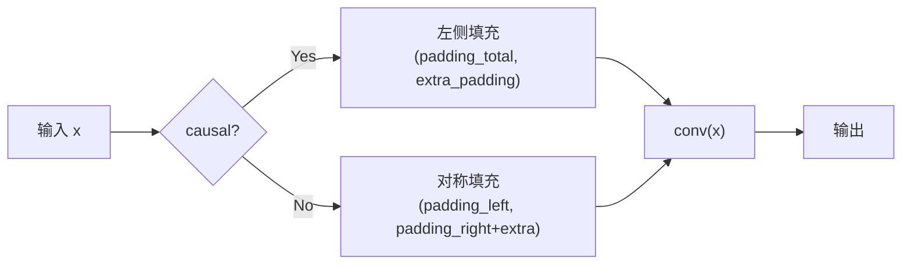

**因果模式**：只在左侧填充 `padding_total`，确保输出仅依赖当前和过去的信息。

**非因果模式**：左右对称填充，`padding_left = padding_total - padding_right`。

`extra_padding` 由 `get_extra_padding_for_conv1d`（第 127–133 行）计算，确保输出长度对齐。

#### 4.1.4 _forward_streaming：流式前向

**源码位置**：第 327–382 行

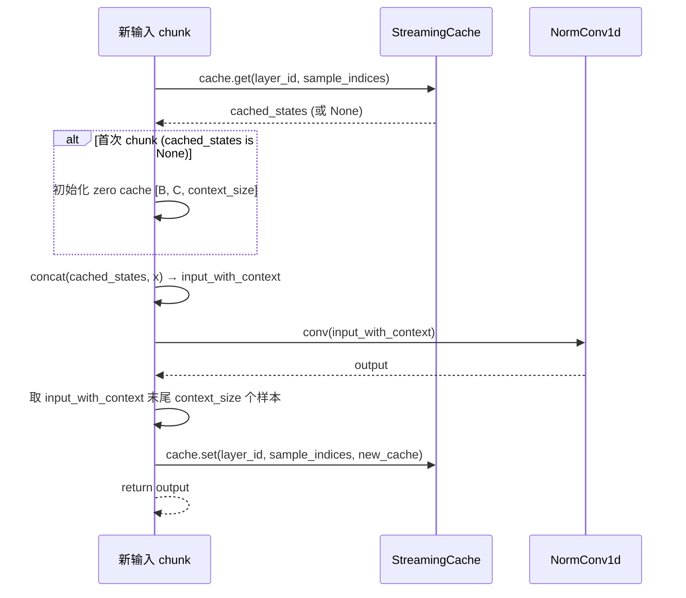

流式推理的核心逻辑：
1. **读取缓存**：从 `cache` 获取上一 chunk 保留的上下文
2. **拼接**：将缓存上下文拼接到当前输入前面
3. **卷积**：对拼接后的输入执行卷积
4. **更新缓存**：保留拼接输入末尾 `context_size` 个样本作为下一 chunk 的上下文

### 4.2 SConvTranspose1d：转置卷积 + 流式缓存

**源码位置**：`modular_vibevoice_tokenizer.py` 第 421–576 行

`SConvTranspose1d` 是解码器中的上采样模块，同样支持流式推理。

#### 4.2.1 初始化

```python
class SConvTranspose1d(nn.Module):  # 第 421 行
    def __init__(self, in_channels, out_channels, kernel_size, stride=1,
                 causal=False, norm='none', trim_right_ratio=1., ...):
```

关键属性：

| 属性 | 计算方式 | 说明 |
|------|---------|------|
| `padding_total` | `kernel_size - stride` | 转置卷积需要裁剪的总量 |
| `context_size` | `kernel_size - 1` | 流式推理需要保留的输入历史 |
| `trim_right_ratio` | 默认 1.0 | 因果模式下右侧裁剪比例 |

#### 4.2.2 _forward_non_streaming（第 551–576 行）

```python
def _forward_non_streaming(self, x, debug=False):
    y = self.convtr(x)  # 转置卷积
    # 计算并移除填充
    if self.causal:
        padding_right = math.ceil(self.padding_total * self.trim_right_ratio)
        padding_left = self.padding_total - padding_right
    else:
        padding_right = self.padding_total // 2
        padding_left = self.padding_total - padding_right
    if padding_left + padding_right > 0:
        y = unpad1d(y, (padding_left, padding_right))
    return y
```

#### 4.2.3 _forward_streaming（第 478–549 行）

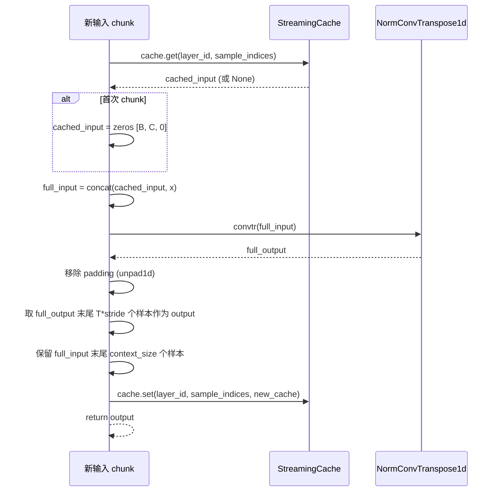

与 `SConv1d` 的流式推理类似，但关键区别：
- 缓存的是**输入历史**而非上下文
- 输出需要裁剪到 `T * stride` 长度（仅保留当前 chunk 对应的新输出）
- 首次 chunk 返回全部输出，后续 chunk 只返回新增部分

### 4.3 Block1D：ConvNeXt-style 残差块

**源码位置**：`modular_vibevoice_tokenizer.py` 第 620–684 行

`Block1D` 是分词器的基本构建单元，采用 ConvNeXt 风格的设计：DepthwiseConv + FFN + LayerScale + DropPath。

#### 4.3.1 架构图

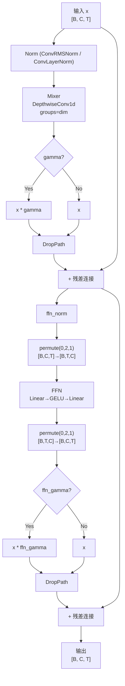

#### 4.3.2 初始化参数

```python
class Block1D(nn.Module):  # 第 620 行
    def __init__(self, dim, kernel_size=7, drop_path=0., mixer_layer='conv',
                 layer_scale_init_value=1e-6, **kwargs):
```

| 组件 | 说明 |
|------|------|
| `norm` | 主归一化层（ConvLayerNorm 或 ConvRMSNorm） |
| `mixer` | 混合层，支持 `'conv'`（普通卷积）或 `'depthwise_conv'`（深度可分离卷积，groups=dim） |
| `ffn` | 前馈网络 `Linear(dim, 4*dim) → GELU → Linear(4*dim, dim)` |
| `gamma` | LayerScale 参数，初始值 `1e-6`，形状 `(dim,)` |
| `ffn_gamma` | FFN 的 LayerScale 参数 |
| `drop_path` | DropPath 正则化 |

#### 4.3.3 forward 方法

```python
def forward(self, x):  # 第 665 行
    # Mixer 分支
    residual = x
    x = self.norm(x)
    x = self.mixer(x)
    if self.gamma is not None:
        x = x * self.gamma.unsqueeze(-1)  # LayerScale: [dim] → [1, dim, 1]
    x = residual + self.drop_path(x)

    # FFN 分支
    residual = x
    x = self.ffn_norm(x)
    x = x.permute(0, 2, 1)  # [B, C, T] → [B, T, C] 适配 nn.Linear
    x = self.ffn(x)
    x = x.permute(0, 2, 1)  # [B, T, C] → [B, C, T]
    if self.ffn_gamma is not None:
        x = x * self.ffn_gamma.unsqueeze(-1)
    x = residual + self.drop_path(x)
    return x
```

**ConvNeXt 风格特征**：
1. **DepthwiseConv**：`mixer_layer='depthwise_conv'` 时使用 `groups=dim` 的深度可分离卷积
2. **LayerScale**：可学习的缩放因子，初始值极小（1e-6），训练初期接近恒等映射
3. **DropPath**：随机深度正则化
4. **倒残差结构**：先归一化再卷积/FFN，最后残差连接

### 4.4 NormConv1d / NormConvTranspose1d：归一化卷积包装器

**源码位置**：第 163–190 行

这两个类是对标准 `Conv1d` / `ConvTranspose1d` 的包装，在卷积后自动应用归一化。

#### NormConv1d（第 163 行）

```python
class NormConv1d(nn.Module):
    def __init__(self, *args, causal=False, norm='none', norm_kwargs={}, **kwargs):
        self.conv = apply_parametrization_norm(nn.Conv1d(*args, **kwargs), norm)
        self.norm = get_norm_module(self.conv, causal, norm, **norm_kwargs)

    def forward(self, x):
        x = self.conv(x)
        x = self.norm(x)
        return x
```

#### NormConvTranspose1d（第 178 行）

结构与 `NormConv1d` 完全对称，只是内部使用 `ConvTranspose1d`。

**归一化流程**：

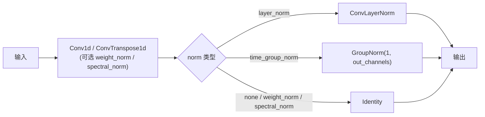

`apply_parametrization_norm`（第 98 行）对卷积核应用参数化归一化（weight_norm / spectral_norm），而 `get_norm_module`（第 110 行）返回卷积后应用的归一化模块。

### 4.5 归一化模块

#### 4.5.1 ConvLayerNorm（第 39 行）

```python
class ConvLayerNorm(nn.LayerNorm):
    def forward(self, x):
        x = x.transpose(1, 2)  # [B, C, T] → [B, T, C]
        x = F.layer_norm(x.float(), self.normalized_shape, self.weight.float(), self.bias.float(), self.eps).type_as(x)
        x = x.transpose(1, 2)  # [B, T, C] → [B, C, T]
        return x
```

对卷积格式 `[B, C, T]` 友好的 LayerNorm，自动转置到 `[B, T, C]` 执行归一化后再转回。

#### 4.5.2 RMSNorm（第 53 行）

```python
class RMSNorm(nn.Module):
    def _norm(self, x):
        return x * torch.rsqrt(x.pow(2).mean(-1, keepdim=True) + self.eps)

    def forward(self, x):
        output = self._norm(x.float()).type_as(x)
        if self.weight is not None:
            output = output * self.weight
        return output
```

RMSNorm 不计算均值减法，仅除以 RMS（均方根），计算更高效：

$$\text{RMSNorm}(x) = \frac{x}{\sqrt{\frac{1}{d}\sum_{i=1}^{d}x_i^2 + \epsilon}} \cdot w$$

#### 4.5.3 ConvRMSNorm（第 77 行）

```python
class ConvRMSNorm(RMSNorm):
    def forward(self, x):
        x = x.transpose(1, 2)  # [B, C, T] → [B, T, C]
        if (not APEX_AVAILABLE) or (not self.elementwise_affine):
            output = self._norm(x.float()).type_as(x)
            if self.weight is not None:
                output = output * self.weight
        else:
            output = fused_rms_norm_affine(x, self.weight, self.weight.shape, self.eps)
        output = output.transpose(1, 2)  # [B, T, C] → [B, C, T]
        return output
```

与 `ConvLayerNorm` 类似的转置逻辑，但使用 RMSNorm。额外支持 APEX FusedRMSNorm 加速（第 26–36 行），可通过环境变量 `OPTIMIZE_FOR_SPEED` 控制。

### 4.6 辅助函数

#### get_extra_padding_for_conv1d（第 127 行）

计算卷积输出长度对齐所需的额外填充量：

```python
def get_extra_padding_for_conv1d(x, kernel_size, stride, padding_total=0):
    length = x.shape[-1]
    n_frames = (length - kernel_size + padding_total) / stride + 1
    ideal_length = (math.ceil(n_frames) - 1) * stride + (kernel_size - padding_total)
    return ideal_length - length
```

#### pad1d / unpad1d（第 136 / 154 行）

- `pad1d`：1D 填充，特殊处理 reflect 模式下短序列的情况
- `unpad1d`：移除 1D 填充

### 4.7 FFN 与 Convlayer

#### FFN（第 579 行）

```python
class FFN(nn.Module):
    def __init__(self, embed_dim, ffn_dim, bias=False):
        self.linear1 = nn.Linear(embed_dim, ffn_dim, bias=bias)
        self.gelu = ACT2FN["gelu"]
        self.linear2 = nn.Linear(ffn_dim, embed_dim, bias=bias)

    def forward(self, x):
        x = self.linear1(x)
        x = self.gelu(x)
        x = self.linear2(x)
        return x
```

标准两层前馈网络，扩展比默认为 4（`ffn_expansion=4`，见 Block1D 第 653 行）。

#### Convlayer（第 599 行）

```python
class Convlayer(nn.Module):
    def __init__(self, in_channels, out_channels, kernel_size, stride=1, ...):
        self.conv = SConv1d(in_channels, out_channels, kernel_size, stride=stride, ...)

    def forward(self, x):
        return self.conv(x)
```

`SConv1d` 的简单封装，用于 Block1D 的 mixer。

---

## 5. VibeVoiceTokenizerStreamingCache 流式缓存系统

**源码位置**：`modular_vibevoice_tokenizer.py` 第 193–256 行

### 5.1 设计理念

流式缓存系统类似于 Transformer 中的 KV Cache，用于在流式推理时保存卷积层的上下文状态，使得模型可以逐 chunk 处理音频而不丢失跨 chunk 的依赖信息。

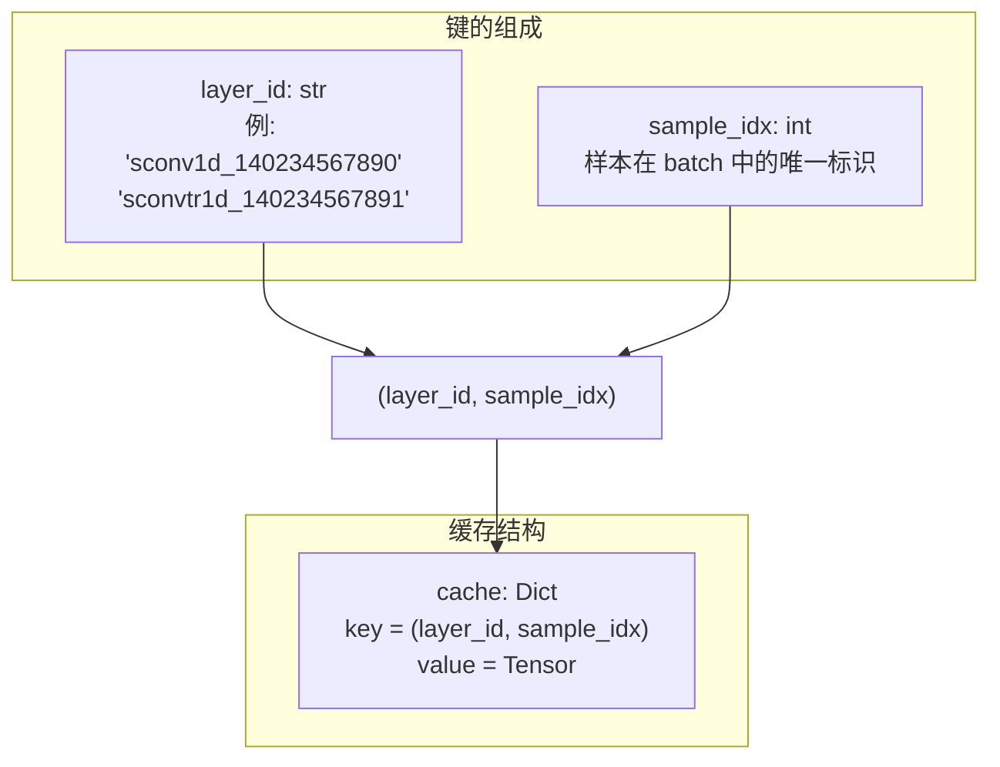

### 5.2 缓存键设计

缓存使用 `(layer_id, sample_idx)` 二元组作为键：

- **`layer_id`**：每个 `SConv1d` / `SConvTranspose1d` 实例的唯一标识
  - `SConv1d`：`f"sconv1d_{id(self)}"`（第 293 行）
  - `SConvTranspose1d`：`f"sconvtr1d_{id(self)}"`（第 455 行）
  - 使用 Python 对象的 `id()` 确保唯一性

- **`sample_idx`**：样本在 batch 中的索引，来自 `sample_indices` 张量
  - 允许同一 batch 中不同样本拥有独立的缓存状态

### 5.3 方法详解

#### get 方法（第 198 行）

```python
def get(self, layer_id: str, sample_indices: torch.Tensor) -> Optional[torch.Tensor]:
```

**流程**：

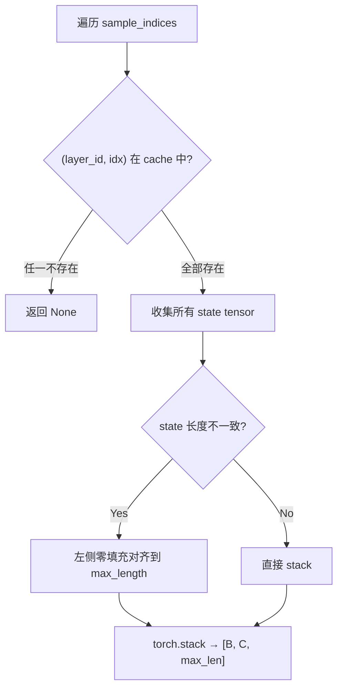

关键细节：
- 如果 batch 中任一样本缺失缓存，整体返回 `None`（触发初始化逻辑）
- 不同样本的缓存长度可能不同（流式推理中 chunk 大小可变），通过左侧零填充对齐
- 左侧填充（`F.pad(state, (pad_size, 0))`）确保最新采样点对齐

#### set 方法（第 228 行）

```python
def set(self, layer_id: str, sample_indices: torch.Tensor, states: torch.Tensor):
```

将 `states[i]` 以 `.detach()` 方式存入缓存，避免计算图保留：

```python
for i, idx in enumerate(sample_indices.tolist()):
    key = (layer_id, idx)
    self.cache[key] = states[i].detach()
```

#### set_to_zero 方法（第 234 行）

```python
def set_to_zero(self, sample_indices: torch.Tensor):
```

将指定样本的所有层缓存置零（保留形状和 dtype），用于重置特定样本的流式状态而不完全删除：

```python
for key in list(self.cache.keys()):
    layer_id, sample_idx = key
    if sample_idx in sample_indices.tolist():
        self.cache[key] = torch.zeros_like(cached_tensor)
```

#### clear 方法（第 243 行）

```python
def clear(self, layer_id=None, sample_indices=None):
```

支持三种清除粒度：

| `layer_id` | `sample_indices` | 行为 |
|------------|------------------|------|
| `None` | `None` | 清空全部缓存 |
| 指定 | `None` | 清除指定层的所有样本缓存 |
| 指定 | 指定 | 清除指定层+指定样本的缓存 |

### 5.4 流式推理数据流

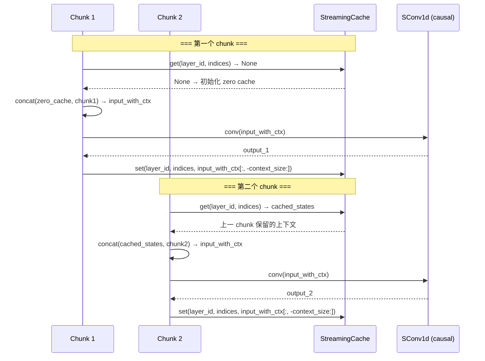

---

## 6. VibeVoiceTokenizerEncoderOutput 编码器输出与采样逻辑

**源码位置**：`modular_vibevoice_tokenizer.py` 第 954–1000 行

### 6.1 数据类定义

```python
@dataclass
class VibeVoiceTokenizerEncoderOutput:  # 第 954 行
    mean: torch.Tensor                          # 均值参数
    std: Optional[Union[float, torch.Tensor]] = None  # 标准差（可选）
```

表示一个固定方差的高斯分布，其中 `mean` 是编码器输出的均值，`std` 是固定的标准差。

### 6.2 sample 方法

**源码位置**：第 966–991 行

三种采样模式：

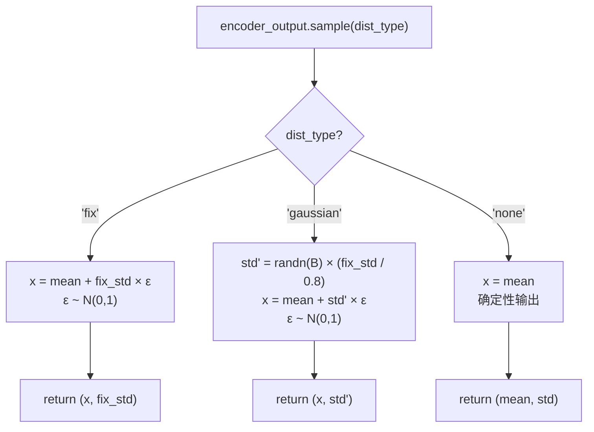

#### fix 模式（第 977–979 行）

```python
if dist_type == 'fix':
    x = self.mean + self.std * torch.randn_like(self.mean)
    return x, self.std
```

- 标准差固定为 `self.std`（全局标量，默认 0.5）
- 每个时间步、每个维度使用相同的标准差
- 重参数化：$x = \mu + \sigma \cdot \epsilon, \quad \epsilon \sim \mathcal{N}(0, 1)$

#### gaussian 模式（第 980–989 行）

```python
elif dist_type == 'gaussian':
    batch_size = self.mean.size(0)
    value = self.std / 0.8
    std = torch.randn(batch_size, device=self.mean.device, dtype=self.mean.dtype) * value
    while std.dim() < self.mean.dim():
        std = std.unsqueeze(-1)
    x = self.mean + std * torch.randn_like(self.mean)
    return x, std
```

- 标准差在每个样本级别随机采样：$\sigma' = \epsilon_\sigma \times \frac{\sigma_{\text{fix}}}{0.8}, \quad \epsilon_\sigma \sim \mathcal{N}(0, 1)$
- `std` 形状为 `[batch_size, 1, 1]`（通过 `unsqueeze` 扩展到与 `mean` 相同维度）
- 同一样本内所有时间步和维度共享同一个随机标准差
- 除以 0.8 的作用是调整标准差的期望尺度

#### none 模式（第 990–991 行）

```python
else:
    return self.mean, self.std
```

确定性输出，直接返回均值，不添加任何噪声。语义分词器使用此模式。

### 6.3 kl 方法

**源码位置**：第 993–996 行

```python
def kl(self):
    """Compute KL divergence between this distribution and a standard normal."""
    target = torch.zeros_like(self.mean)
    return F.mse_loss(self.mean, target, reduction='none')
```

计算与标准正态分布的 KL 散度。由于方差固定，KL 散度简化为均值的 MSE 损失：

$$D_{\text{KL}}(q \| p) \propto \|\mu - 0\|^2 = \text{MSE}(\mu, \mathbf{0})$$

> 注意：这不是完整的 KL 散度公式（缺少方差项），而是简化版本，仅惩罚均值偏离零。

### 6.4 mode 方法

**源码位置**：第 998–1000 行

```python
def mode(self):
    return self.mean
```

返回分布的众数，对于高斯分布即为均值。

### 6.5 三种采样模式对比

| 特征 | fix | gaussian | none |
|------|-----|----------|------|
| **噪声来源** | `randn_like(mean)` | `randn_like(mean)` + 随机 std | 无 |
| **标准差** | 固定 `fix_std` | 每样本随机 | N/A |
| **随机性** | 中等 | 更高（双重随机） | 无 |
| **适用场景** | 声学分词器训练 | 声学分词器训练 | 语义分词器推理 |
| **返回值** | `(sampled, fix_std)` | `(sampled, random_std)` | `(mean, std)` |

---

## 附录：模块依赖关系图

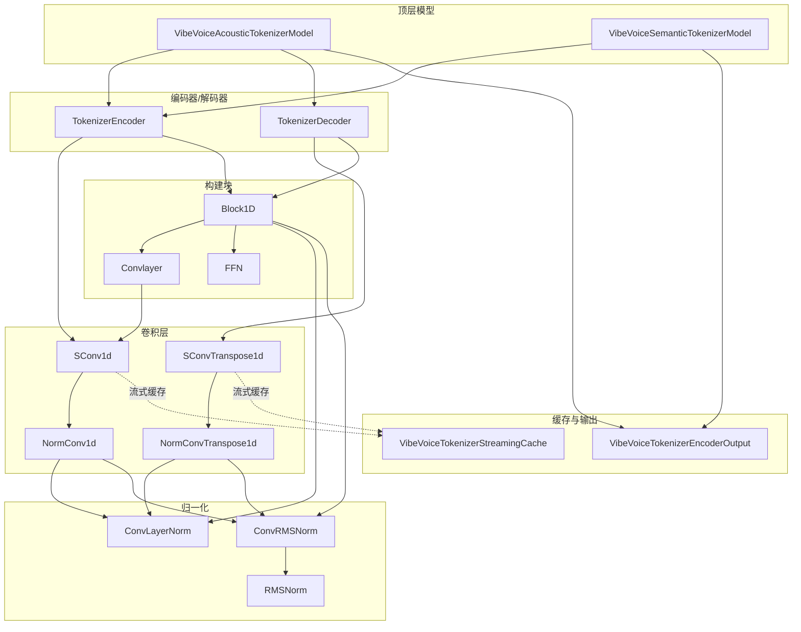

---

## 附录：关键行号索引

| 模块 | 行号 |
|------|------|
| ConvLayerNorm | 39–51 |
| RMSNorm | 53–75 |
| ConvRMSNorm | 77–91 |
| get_extra_padding_for_conv1d | 127–133 |
| pad1d / unpad1d | 136–160 |
| NormConv1d | 163–175 |
| NormConvTranspose1d | 178–190 |
| VibeVoiceTokenizerStreamingCache | 193–256 |
| SConv1d | 258–418 |
| SConvTranspose1d | 421–576 |
| FFN | 579–596 |
| Convlayer | 599–618 |
| Block1D | 620–684 |
| TokenizerEncoder | 687–813 |
| TokenizerDecoder | 816–951 |
| VibeVoiceTokenizerEncoderOutput | 954–1000 |
| VibeVoiceAcousticTokenizerModel | 1002–1115 |
| VibeVoiceSemanticTokenizerModel | 1118–1186 |
