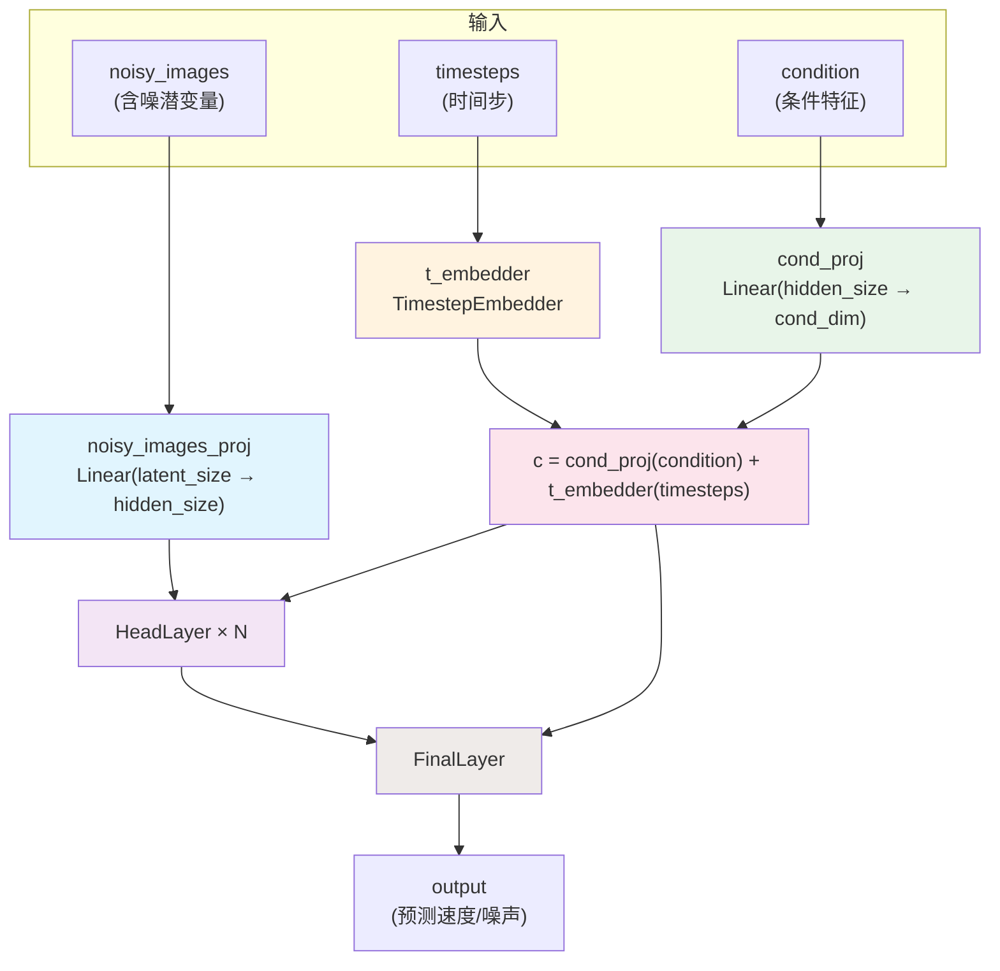
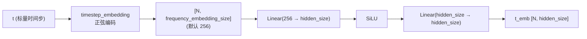
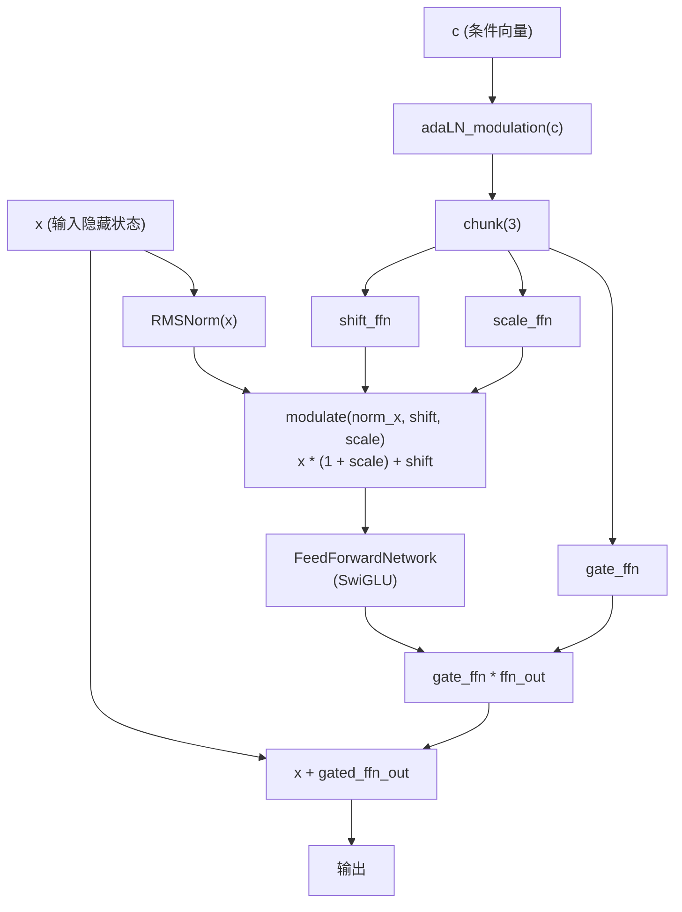
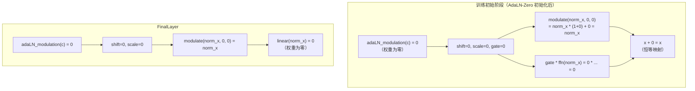
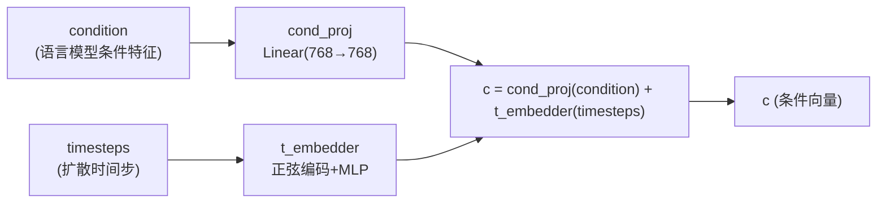

# VibeVoice 扩散头（Diffusion Head）详解

> 源文件：[`/workspace/vibevoice/modular/modular_vibevoice_diffusion_head.py`](../vibevoice/modular/modular_vibevoice_diffusion_head.py)
> 配置文件：[`/workspace/vibevoice/modular/configuration_vibevoice.py`](../vibevoice/modular/configuration_vibevoice.py)（`VibeVoiceDiffusionHeadConfig` 类，第 130 行）

---

## 1. VibeVoiceDiffusionHead 整体架构

`VibeVoiceDiffusionHead` 是 VibeVoice 模型中负责语音潜变量去噪的核心模块。它接收含噪潜变量、时间步和条件特征作为输入，输出预测的速度（velocity）或噪声（epsilon），用于引导扩散采样过程。

### 1.1 核心组件概览

| 组件 | 代码位置 | 功能 |
|------|---------|------|
| `noisy_images_proj` | 第 213 行 | 将含噪潜变量线性投影到隐藏维度 |
| `cond_proj` | 第 214 行 | 将条件特征线性投影到条件维度 |
| `t_embedder` | 第 215 行 | 将时间步编码为条件向量 |
| `layers` | 第 220–228 行 | N 层 `HeadLayer`，核心变换层 |
| `final_layer` | 第 231–236 行 | 最终输出层，将隐藏状态映射回潜变量空间 |

### 1.2 架构总览图



### 1.3 初始化参数

```python
# 第 204–238 行
def __init__(self, config):
    self.cond_dim = config.hidden_size
    latent_size = config.latent_size

    self.noisy_images_proj = nn.Linear(latent_size, config.hidden_size, bias=False)   # 第 213 行
    self.cond_proj = nn.Linear(config.hidden_size, self.cond_dim, bias=False)          # 第 214 行
    self.t_embedder = TimestepEmbedder(self.cond_dim)                                  # 第 215 行

    ffn_dim = int(config.hidden_size * config.head_ffn_ratio)                          # 第 217 行

    self.layers = nn.ModuleList([                                                      # 第 220–228 行
        HeadLayer(embed_dim=config.hidden_size, ffn_dim=ffn_dim,
                  cond_dim=self.cond_dim, norm_eps=config.rms_norm_eps)
        for _ in range(config.head_layers)
    ])

    self.final_layer = FinalLayer(                                                    # 第 231–236 行
        hidden_size=config.hidden_size, output_size=latent_size,
        cond_size=self.cond_dim, norm_eps=config.rms_norm_eps
    )
```

配置默认值（`configuration_vibevoice.py` 第 133–147 行）：

| 参数 | 默认值 | 说明 |
|------|--------|------|
| `hidden_size` | 768 | 隐藏层维度 |
| `head_layers` | 4 | HeadLayer 层数 |
| `head_ffn_ratio` | 3.0 | FFN 隐藏维度 = hidden_size × ratio |
| `rms_norm_eps` | 1e-5 | RMSNorm epsilon |
| `latent_size` | 64 | 潜变量空间维度 |
| `prediction_type` | `"v_prediction"` | 预测类型 |

---

## 2. 核心组件详解

### 2.1 noisy_images_proj：含噪潜变量投影

```python
# 第 213 行
self.noisy_images_proj = nn.Linear(latent_size, config.hidden_size, bias=False)
```

将输入的含噪潜变量从 `latent_size`（默认 64）维空间线性映射到 `hidden_size`（默认 768）维的隐藏空间。这是模型处理含噪输入的第一步，**无偏置项**。

### 2.2 cond_proj：条件特征投影

```python
# 第 214 行
self.cond_proj = nn.Linear(config.hidden_size, self.cond_dim, bias=False)
```

将来自语言模型的条件特征（`condition`）投影到条件维度 `cond_dim`（等于 `hidden_size`）。由于输入和输出维度相同，此投影的作用是对条件特征进行一次线性变换以适配后续的 AdaLN 调制。**无偏置项**。

### 2.3 TimestepEmbedder：时间步嵌入器

**代码位置：第 48–93 行**

时间步嵌入分为两个阶段：**正弦位置编码** → **MLP 投影**。



#### 2.3.1 正弦位置编码（第 66–88 行）

```python
@staticmethod
def timestep_embedding(t, dim, max_period=10000):
    half = dim // 2
    freqs = torch.exp(
        -math.log(max_period) * torch.arange(start=0, end=half, dtype=torch.float32) / half
    ).to(t.device)
    args = t[:, None].float() * freqs[None]
    embedding = torch.cat([torch.cos(args), torch.sin(args)], dim=-1)
    if dim % 2:
        embedding = torch.cat([embedding, torch.zeros_like(embedding[:, :1])], dim=-1)
    return embedding.to(t.dtype)
```

**编码原理：**

- 频率序列：$\omega_k = \exp\left(-\frac{\ln(10000) \cdot k}{\text{half}}\right)$，其中 $k = 0, 1, \ldots, \text{half}-1$
- 嵌入向量：$\text{emb}(t) = [\cos(\omega_0 t), \cos(\omega_1 t), \ldots, \sin(\omega_0 t), \sin(\omega_1 t), \ldots]$
- 若 `dim` 为奇数，末尾补零保证维度对齐

这与 Transformer 的正弦位置编码思想一致，但应用于连续时间步而非离散位置。

#### 2.3.2 MLP 投影（第 58–63 行）

```python
self.mlp = nn.Sequential(
    nn.Linear(frequency_embedding_size, hidden_size, bias=False),  # 256 → 768
    ACT2FN['silu'],                                                # SiLU 激活
    nn.Linear(hidden_size, hidden_size, bias=False),               # 768 → 768
)
```

两层 MLP，中间用 SiLU 激活，将 256 维正弦编码映射到 `hidden_size` 维的条件空间。**两层 Linear 均无偏置**。

### 2.4 HeadLayer：自适应调制层

**代码位置：第 126–161 行**

HeadLayer 是扩散头的核心变换层，采用 **AdaLN（Adaptive Layer Normalization）+ SwiGLU FFN** 的结构。



#### 2.4.1 adaLN_modulation（第 152–156 行）

```python
self.adaLN_modulation = nn.Sequential(
    ACT2FN['silu'],                                    # SiLU 激活
    nn.Linear(cond_dim, 3 * self.embed_dim, bias=False) # 输出 3 × embed_dim
)
```

从条件向量 `c` 生成三个调制参数：**shift（偏移）**、**scale（缩放）**、**gate（门控）**。

- 输入：`c`，维度为 `cond_dim`
- 输出：`3 * embed_dim`，通过 `chunk(3, dim=-1)` 拆分为三个 `embed_dim` 维的向量

#### 2.4.2 modulate 函数（第 43–45 行）

```python
def modulate(x, shift, scale):
    return x * (1 + scale) + shift
```

对归一化后的输入进行仿射变换：
- 当 `scale = 0, shift = 0` 时，输出等于输入（恒等变换）
- 这与 AdaLN-Zero 初始化策略紧密配合

#### 2.4.3 FeedForwardNetwork（SwiGLU，第 96–123 行）

```python
class FeedForwardNetwork(nn.Module):
    def __init__(self, embed_dim, ffn_dim):
        self.gate_proj = nn.Linear(embed_dim, ffn_dim, bias=False)   # 门控投影
        self.up_proj = nn.Linear(embed_dim, ffn_dim, bias=False)     # 上投影
        self.down_proj = nn.Linear(ffn_dim, embed_dim, bias=False)   # 下投影
        self.act_fn = ACT2FN['silu']

    def forward(self, x):
        gate = self.act_fn(self.gate_proj(x))   # SiLU(W_g · x)
        up = self.up_proj(x)                     # W_u · x
        return self.down_proj(gate * up)          # W_d · (SiLU(W_g · x) ⊙ W_u · x)
```

**SwiGLU 公式：**

$$\text{FFN}(x) = W_d \cdot \left(\text{SiLU}(W_g \cdot x) \odot W_u \cdot x\right)$$

其中 $\odot$ 表示逐元素乘法。相比标准 ReLU FFN，SwiGLU 通过门控机制提供更强的表达能力。

#### 2.4.4 HeadLayer 前向传播（第 158–161 行）

```python
def forward(self, x, c):
    shift_ffn, scale_ffn, gate_ffn = self.adaLN_modulation(c).chunk(3, dim=-1)
    x = x + gate_ffn * self.ffn(modulate(self.norm(x), shift_ffn, scale_ffn))
    return x
```

**执行流程：**
1. 从条件 `c` 生成 `shift`、`scale`、`gate` 三个调制参数
2. 对 `x` 做 RMSNorm
3. 对归一化结果做 modulate：`norm_x * (1 + scale) + shift`
4. 送入 SwiGLU FFN
5. 用 `gate` 对 FFN 输出进行门控缩放
6. 残差连接：`x + gated_ffn_out`

### 2.5 FinalLayer：最终输出层

**代码位置：第 164–188 行**

```python
class FinalLayer(nn.Module):
    def __init__(self, hidden_size, output_size, cond_size, norm_eps=1e-5):
        self.norm_final = RMSNorm(hidden_size, eps=norm_eps, elementwise_affine=False)  # 无仿射参数
        self.linear = nn.Linear(hidden_size, output_size, bias=False)                    # 输出投影
        self.adaLN_modulation = nn.Sequential(
            ACT2FN['silu'],
            nn.Linear(cond_size, 2 * hidden_size, bias=False)                            # 仅输出 shift + scale
        )

    def forward(self, x, c):
        shift, scale = self.adaLN_modulation(c).chunk(2, dim=-1)
        x = modulate(self.norm_final(x), shift, scale)
        x = self.linear(x)
        return x
```

与 HeadLayer 的区别：
- **无门控（gate）**：adaLN 仅输出 `2 × hidden_size`（shift + scale），不需要 gate
- **无残差连接**：直接输出 `linear(modulate(norm(x)))`
- **RMSNorm 无仿射参数**：`elementwise_affine=False`，不学习 scale/shift 参数
- **输出维度不同**：`hidden_size → output_size`（即 768 → 64，映射回潜变量空间）

---

## 3. AdaLN-Zero 初始化策略

**代码位置：第 240–252 行**

```python
def initialize_weights(self):
    # 初始化时间步嵌入器
    nn.init.normal_(self.t_embedder.mlp[0].weight, std=0.02)
    nn.init.normal_(self.t_embedder.mlp[2].weight, std=0.02)

    # 将 adaLN 调制层权重置零
    for layer in self.layers:
        nn.init.constant_(layer.adaLN_modulation[-1].weight, 0)

    # 将输出层权重置零
    nn.init.constant_(self.final_layer.adaLN_modulation[-1].weight, 0)
    nn.init.constant_(self.final_layer.linear.weight, 0)
```

### 3.1 置零对象

| 被置零的层 | 代码行 | 效果 |
|-----------|--------|------|
| `layer.adaLN_modulation[-1].weight` | 第 248 行 | HeadLayer 的 shift=0, scale=0, gate=0 |
| `final_layer.adaLN_modulation[-1].weight` | 第 251 行 | FinalLayer 的 shift=0, scale=0 |
| `final_layer.linear.weight` | 第 252 行 | FinalLayer 的线性输出为 0 |

### 3.2 初始化后的恒等行为



**核心思想：**

1. **HeadLayer**：当 `gate=0` 时，`x + gate * ffn(...) = x + 0 = x`，每一层都是恒等映射
2. **FinalLayer**：当 `linear.weight=0` 时，输出恒为零向量
3. **训练初期**：模型输出零向量，预测的速度为零，相当于"什么都不做"
4. **逐步学习**：随着训练进行，adaLN 调制参数逐渐从零偏移，模型逐步学会去噪

这种策略的优势：
- **训练稳定性**：初始阶段梯度流更稳定，不会因随机初始化产生过大的输出
- **渐进学习**：模型从"恒等/零输出"开始，逐步增加修正量
- **与 DiT 一致**：该策略源自 Diffusion Transformer（DiT）的 AdaLN-Zero 设计

---

## 4. 条件注入机制

### 4.1 条件向量 c 的构造

**代码位置：第 271–274 行**

```python
x = self.noisy_images_proj(noisy_images)
t = self.t_embedder(timesteps)
condition = self.cond_proj(condition)
c = condition + t
```



**关键设计：**

- 条件特征和时间步嵌入在**同一空间**中相加，形成统一的条件向量 `c`
- `c` 的维度为 `cond_dim`（= `hidden_size` = 768）
- 条件信息与时间信息通过加法融合，而非拼接（concatenation），更简洁高效

### 4.2 c 的使用方式

条件向量 `c` 在两个位置被使用：

1. **每个 HeadLayer**（第 276–277 行）：`c → adaLN_modulation → (shift, scale, gate) → 调制隐藏状态`
2. **FinalLayer**（第 279 行）：`c → adaLN_modulation → (shift, scale) → 调制最终输出`

这意味着**条件信息通过自适应归一化的方式注入到每一层**，而非仅在输入端拼接。这种设计允许模型在不同层、不同时间步对条件信息进行差异化利用。

---

## 5. v_prediction 预测类型

### 5.1 配置

```python
# configuration_vibevoice.py 第 141 行
prediction_type="v_prediction"
```

默认采用 `v_prediction`（速度预测）而非 `epsilon`（噪声预测）。

### 5.2 v_prediction 的定义

在训练时（`modeling_vibevoice.py` 第 448–454 行）：

```python
prediction_type = self.config.diffusion_head_config.prediction_type
if prediction_type == "epsilon":
    target_for_loss = noise
elif prediction_type == "v_prediction":
    target_for_loss = self.model.noise_scheduler.get_velocity(
        speech_features_repeated, noise, timesteps
    )
```

**速度（velocity）的数学定义：**

$$v = \alpha_t \cdot \epsilon - \sigma_t \cdot x_0$$

其中：
- $\alpha_t$：时间步 $t$ 处的信号缩放系数
- $\sigma_t$：时间步 $t$ 处的噪声缩放系数
- $\epsilon$：添加的噪声
- $x_0$：原始样本（干净的语音潜变量）

### 5.3 v_prediction vs epsilon prediction

| 特性 | epsilon prediction | v_prediction |
|------|-------------------|--------------|
| 预测目标 | 噪声 $\epsilon$ | 速度 $v = \alpha_t \epsilon - \sigma_t x_0$ |
| 训练损失 | $\| \hat\epsilon - \epsilon \|^2$ | $\| \hat{v} - v \|^2$ |
| 数值稳定性 | 一般 | 更好（尤其在低信噪比时） |
| 推荐场景 | — | 级联扩散、高分辨率生成 |

**v_prediction 的优势：** 根据 [Progressive Distillation for Fast Sampling of Diffusion Models](https://arxiv.org/abs/2202.00512)，v_prediction 在不同信噪比水平下提供更均衡的损失，避免 epsilon prediction 在低 SNR 时梯度信号过大的问题。

---

## 6. 前向传播流程

**代码位置：第 254–280 行**

```python
def forward(self, noisy_images, timesteps, condition):
    x = self.noisy_images_proj(noisy_images)   # 第 271 行：投影含噪潜变量
    t = self.t_embedder(timesteps)              # 第 272 行：编码时间步
    condition = self.cond_proj(condition)        # 第 273 行：投影条件特征
    c = condition + t                            # 第 274 行：融合条件与时间步

    for layer in self.layers:                    # 第 276–277 行：逐层变换
        x = layer(x, c)

    x = self.final_layer(x, c)                   # 第 279 行：最终输出
    return x
```

### 6.1 完整前向传播流程图

```mermaid
flowchart TD
    START([输入]) --> A["noisy_images: [B, latent_size]<br/>timesteps: [B]<br/>condition: [B, hidden_size]"]

    A --> B["noisy_images_proj(noisy_images)<br/>Linear(64→768)<br/>x: [B, 768]"]

    A --> C["t_embedder(timesteps)<br/>正弦编码 + MLP<br/>t: [B, 768]"]
    A --> D["cond_proj(condition)<br/>Linear(768→768)<br/>condition: [B, 768]"]

    C --> E["c = condition + t<br/>c: [B, 768]"]
    D --> E

    B --> F["HeadLayer #1"]
    E --> F

    F --> G["HeadLayer #2"]
    E --> G

    G --> H["HeadLayer #3"]
    E --> H

    H --> I["HeadLayer #N<br/>(默认 N=4)"]
    E --> I

    I --> J["FinalLayer<br/>RMSNorm → modulate → Linear<br/>[B, 768] → [B, 64]"]
    E --> J

    J --> K([输出: 预测速度 v<br/>[B, latent_size]])

    style B fill:#e1f5fe
    style C fill:#fff3e0
    style D fill:#e8f5e9
    style E fill:#fce4ec
    style F fill:#f3e5f5
    style G fill:#f3e5f5
    style H fill:#f3e5f5
    style I fill:#f3e5f5
    style J fill:#efebe9
```

### 6.2 维度变换追踪

以默认配置（`hidden_size=768`, `latent_size=64`, `head_layers=4`, `head_ffn_ratio=3.0`）为例：

| 阶段 | 操作 | 输入维度 | 输出维度 |
|------|------|---------|---------|
| 含噪潜变量投影 | `noisy_images_proj` | `[B, 64]` | `[B, 768]` |
| 时间步编码 | `t_embedder` | `[B]` | `[B, 768]` |
| 条件投影 | `cond_proj` | `[B, 768]` | `[B, 768]` |
| 条件融合 | `c = condition + t` | — | `[B, 768]` |
| HeadLayer ×4 | adaLN + SwiGLU FFN | `[B, 768]` | `[B, 768]` |
| FFN 内部 | gate_proj / up_proj | `[B, 768]` | `[B, 2304]` |
| FFN 内部 | down_proj | `[B, 2304]` | `[B, 768]` |
| FinalLayer | RMSNorm + modulate + Linear | `[B, 768]` | `[B, 64]` |

### 6.3 在整体模型中的调用

在 `modeling_vibevoice.py` 第 442–446 行，扩散头被主模型调用：

```python
model_output = self.model.prediction_head(
    noisy_speech_features,       # 含噪语音潜变量
    timesteps.type_as(x),        # 时间步
    condition_features_repeated   # 重复的条件特征
)
```

其中 `prediction_head` 即为 `VibeVoiceDiffusionHead` 的实例（第 135 行通过 `AutoModel.from_config` 自动加载）。

---

## 7. 辅助模块：RMSNorm

**代码位置：第 20–41 行**

```python
class RMSNorm(nn.Module):
    def __init__(self, dim, eps=1e-6, elementwise_affine=True):
        self.weight = nn.Parameter(torch.ones(dim))  # 可选的仿射参数

    def _norm(self, x):
        return x * torch.rsqrt(x.pow(2).mean(-1, keepdim=True) + self.eps)

    def forward(self, x):
        output = self._norm(x.float()).type_as(x)
        if self.weight is not None:
            output = output * self.weight
        return output
```

**RMSNorm vs LayerNorm：**
- RMSNorm 不计算均值偏移，仅做缩放归一化：$\text{RMSNorm}(x) = \frac{x}{\sqrt{\text{mean}(x^2) + \epsilon}} \cdot w$
- 计算量更小，无需均值计算
- 在 HeadLayer 中使用带仿射参数的 RMSNorm（`elementwise_affine=True`），但在 FinalLayer 中使用不带仿射参数的版本（`elementwise_affine=False`），因为仿射变换由 AdaLN 的 modulate 函数承担

---

## 8. 设计总结

```mermaid
mindmap
  root((VibeVoice<br/>Diffusion Head))
    架构
      输入投影
        noisy_images_proj
        cond_proj
      时间步编码
        正弦位置编码
        两层MLP
      核心层 ×N
        RMSNorm
        AdaLN调制
        SwiGLU FFN
        残差连接
      输出层
        RMSNorm(无仿射)
        AdaLN调制
        线性投影
    初始化
      AdaLN-Zero
        调制层权重置零
        输出层权重置零
        初始恒等/零输出
      TimestepEmbedder
        正态初始化(std=0.02)
    条件注入
      c = cond_proj(condition) + t_embedder(t)
      每层AdaLN调制
    预测类型
      v_prediction(默认)
        velocity = α·ε - σ·x₀
        数值更稳定
      epsilon(可选)
```

VibeVoice 扩散头的设计核心可以概括为：

1. **AdaLN-Zero 条件注入**：条件信息（语言模型特征 + 时间步）通过自适应归一化注入每一层，而非简单拼接，允许模型在不同层差异化利用条件
2. **零初始化保证稳定性**：AdaLN 调制层和最终输出层权重置零，使模型初始输出为零，训练从恒等映射开始逐步学习
3. **SwiGLU 前馈网络**：门控机制提供更强的非线性表达能力
4. **v_prediction 预测**：相比 epsilon prediction，在不同信噪比下梯度更均衡，训练更稳定
5. **轻量级设计**：仅 4 层 HeadLayer，参数量相对较小，适合作为大语言模型的附加组件
