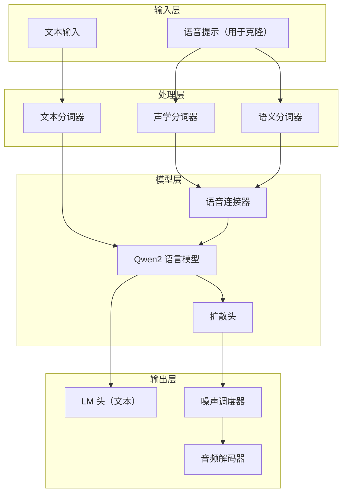

# 多说话人TTS模型详解

## 一、整体架构

VibeVoice 的多说话人 TTS 模型采用了混合架构设计，将自回归语言模型与扩散模型结合，实现高质量、支持多说话人的语音合成。

### 核心组件



## 二、VibeVoiceModel 基础模型

### 初始化

在 [`vibevoice/modular/modeling_vibevoice.py`](file:///workspace/vibevoice/modular/modeling_vibevoice.py#L106-L142) 中定义：

```python
class VibeVoiceModel(VibeVoicePreTrainedModel):
    def __init__(self, config):
        super().__init__(config)
        
        # 初始化 Qwen2 语言模型
        self.language_model = AutoModel.from_config(config.decoder_config)
        
        # 初始化语音分词器
        self.acoustic_tokenizer = AutoModel.from_config(config.acoustic_tokenizer_config)
        self.semantic_tokenizer = AutoModel.from_config(config.semantic_tokenizer_config)
        
        # 语音连接器
        self.acoustic_connector = SpeechConnector(config.acoustic_vae_dim, lm_config.hidden_size)
        self.semantic_connector = SpeechConnector(config.semantic_vae_dim, lm_config.hidden_size)
        
        # 注册缩放因子
        self.register_buffer('speech_scaling_factor', torch.tensor(float('nan')))
        self.register_buffer('speech_bias_factor', torch.tensor(float('nan')))
        
        # 扩散预测头
        self.prediction_head = AutoModel.from_config(config.diffusion_head_config)
        
        # 噪声调度器
        self.noise_scheduler = DPMSolverMultistepScheduler(...)
```

### SpeechConnector

语音连接器用于将声学/语义隐空间特征映射到语言模型的隐空间：

```python
class SpeechConnector(nn.Module):
    def __init__(self, input_dim, output_dim):
        super().__init__()
        self.fc1 = nn.Linear(input_dim, output_dim)
        self.norm = LlamaRMSNorm(output_dim, eps=1e-6)
        self.fc2 = nn.Linear(output_dim, output_dim)

    def forward(self, features, **kwargs):    
        x = self.fc1(features)
        x = self.norm(x)
        x = self.fc2(x)
        return x
```

## 三、VibeVoiceForConditionalGeneration 训练模型

### forward_speech_features 方法

此方法处理语音输入，提取声学特征并应用缩放：

```python
def forward_speech_features(self, speech_tensors=None, speech_masks=None, speech_type="audio", return_unmask=False):
    if speech_tensors is None:
        # 返回默认特征
        ...
    else:
        with torch.no_grad():
            if speech_type == "audio":
                # 编码音频到声学隐空间
                frames = self.model.acoustic_tokenizer.encode(speech_tensors.unsqueeze(1))[0][0]
                audio_tokens = frames.sample(self.model.acoustic_tokenizer.std_dist_type)[0]
            
            # 计算缩放因子（如果未初始化）
            if torch.isnan(self.model.speech_scaling_factor):
                scaling_factor = 1. / audio_tokens[speech_masks].flatten().std()
                bias_factor = -audio_tokens[speech_masks].flatten().mean()
                
                # 分布式训练时的规约
                if dist.is_available() and dist.is_initialized():
                    dist.all_reduce(scaling_factor, op=dist.ReduceOp.SUM)
                    dist.all_reduce(bias_factor, op=dist.ReduceOp.SUM)
                    world_size = dist.get_world_size()
                    self.model.speech_scaling_factor.copy_(scaling_factor / world_size)
                    self.model.speech_bias_factor.copy_(bias_factor / world_size)
                else:
                    self.model.speech_scaling_factor.copy_(scaling_factor)
                    self.model.speech_bias_factor.copy_(bias_factor)
            
            # 应用缩放
            audio_features = (audio_tokens + self.model.speech_bias_factor) * self.model.speech_scaling_factor
        
        # 通过连接器
        connect_features = self.model.acoustic_connector(audio_features)
        return audio_features[speech_masks], connect_features[speech_masks]
```

**缩放因子的作用**：将声学特征归一化到与文本嵌入相似的分布范围，确保两种模态在语言模型中能够正确融合。

### forward 方法完整流程

训练时的前向传播：

```python
def forward(self, input_ids, attention_mask, ..., speech_tensors=None, speech_masks=None, ...):
    # 1. 获取文本嵌入
    x = self.get_input_embeddings()(input_ids)
    
    # 2. 处理语义语音特征
    semantic_speech_all_connect_features = self.model.semantic_connector(speech_semantic_tensors)
    
    # 3. 处理声学语音特征
    if speeches_loss_input is not None:
        speech_all_features, speech_all_connect_features = self.forward_speech_features(...)
        # 替换输入嵌入中的语音位置
        x[acoustic_input_mask] = speech_all_connect_features[speech_masks] + semantic_speech_all_connect_features[speech_masks]
    else:
        speech_features, speech_connect_features = self.forward_speech_features(...)
        x[acoustic_input_mask] = speech_connect_features
    
    # 4. 通过语言模型
    outputs = self.model(inputs_embeds=x, ...)
    hidden_states = outputs.last_hidden_state
    logits = self.lm_head(hidden_states)
    
    # 5. 计算扩散损失
    diffusion_loss = None
    if speech_tensors is not None and acoustic_loss_mask.sum().item() > 0:
        condition_features = hidden_states[acoustic_loss_mask]
        
        # 生成噪声和时间步
        noise = torch.randn(...)
        timesteps = torch.multinomial(...)
        
        # 重复特征以加速训练
        speech_features_repeated = speech_features.repeat_interleave(ddpm_batch_mul, dim=0)
        condition_features_repeated = condition_features.repeat_interleave(ddpm_batch_mul, dim=0)
        
        # 添加噪声
        noisy_speech_features = self.model.noise_scheduler.add_noise(
            speech_features_repeated, noise, timesteps
        )
        
        # 预测
        model_output = self.model.prediction_head(
            noisy_speech_features, timesteps, condition_features_repeated
        )
        
        # 计算损失
        if prediction_type == "v_prediction":
            target_for_loss = self.model.noise_scheduler.get_velocity(
                speech_features_repeated, noise, timesteps
            )
        
        diffusion_loss = F.mse_loss(model_output.float(), target_for_loss.float(), reduction='sum')
```

**ddpm_batch_mul 的作用**：通过重复特征多次进行噪声预测，提高训练效率。

## 四、VibeVoiceForConditionalGenerationInference 推理模型

### generate 方法详解

在 [`vibevoice/modular/modeling_vibevoice_inference.py`](file:///workspace/vibevoice/modular/modeling_vibevoice_inference.py#L326-L697) 中实现了完整的推理流程：

```python
@torch.no_grad()
def generate(self, inputs, ..., audio_streamer=None, cfg_scale=1.0, ...):
    # 1. 准备生成配置
    tokenizer = kwargs.pop("tokenizer", None)
    generation_config, model_kwargs, input_ids, logits_processor, stopping_criteria = \
        self._build_generate_config_model_kwargs(...)
    
    # 2. 准备负提示（用于 CFG）
    negative_kwargs = {...}
    negative_generation_config, negative_model_kwargs, negative_input_ids = \
        self._build_generate_config_model_kwargs(...)
    
    # 3. 初始化流式缓存
    acoustic_cache = VibeVoiceTokenizerStreamingCache()
    semantic_cache = VibeVoiceTokenizerStreamingCache()
    
    # 4. 初始化音频块存储
    audio_chunks = [[] for _ in range(batch_size)]
    
    # 5. 添加 token 约束处理器
    valid_tokens = [speech_start_id, speech_end_id, speech_diffusion_id, eos_token_id]
    token_constraint_processor = VibeVoiceTokenConstraintProcessor(valid_tokens, device=device)
    logits_processor.append(token_constraint_processor)
    
    # 6. 生成循环
    for step in progress_bar:
        # 6.1 检查停止条件
        if finished_tags.all():
            break
        
        # 6.2 模型前向传播
        model_inputs = self.prepare_inputs_for_generation(input_ids, **model_kwargs)
        outputs = self(**model_inputs, **prefill_inputs, logits_to_keep=1, ...)
        
        # 6.3 选择下一个 token
        next_token_logits = outputs.logits[:, -1, :]
        next_token_scores = logits_processor(input_ids, next_token_logits)
        next_tokens = torch.argmax(next_token_scores, dim=-1)  # 或采样
        
        # 6.4 处理 speech_start token
        diffusion_start_indices = next_tokens == speech_start_id
        
        # 6.5 处理 speech_diffusion token（核心语音生成）
        diffusion_indices = next_tokens == speech_diffusion_id
        if diffusion_indices.numel() > 0:
            # 负提示前向传播
            negative_outputs = self(**negative_model_inputs, ...)
            
            # CFG 采样
            positive_condition = outputs.last_hidden_state[diffusion_indices, -1, :]
            negative_condition = negative_outputs.last_hidden_state[diffusion_indices, -1, :]
            
            speech_latent = self.sample_speech_tokens(
                positive_condition, negative_condition, cfg_scale=cfg_scale
            ).unsqueeze(1)
            
            # 解码声学隐空间到音频
            scaled_latent = speech_latent / self.speech_scaling_factor - self.speech_bias_factor
            audio_chunk = self.acoustic_tokenizer.decode(
                scaled_latent, cache=acoustic_cache, sample_indices=diffusion_indices
            )
            
            # 存储音频块
            for i, sample_idx in enumerate(diffusion_indices):
                audio_chunks[sample_idx.item()].append(audio_chunk[i])
            
            # 流式输出
            if audio_streamer is not None:
                audio_streamer.put(audio_chunk, diffusion_indices)
            
            # 编码音频到语义特征（用于下一步输入）
            semantic_features = self.semantic_tokenizer.encode(
                audio_chunk, cache=semantic_cache, sample_indices=diffusion_indices
            ).mean
            
            # 组合声学和语义特征
            acoustic_embed = self.acoustic_connector(speech_latent)
            semantic_embed = self.semantic_connector(semantic_features)
            diffusion_embeds = acoustic_embed + semantic_embed
            
            # 更新下一次的输入嵌入
            next_inputs_embeds[diffusion_indices] = diffusion_embeds
        
        # 6.6 处理 speech_end token
        diffusion_end_indices = next_tokens == speech_end_id
        if diffusion_end_indices.numel() > 0:
            acoustic_cache.set_to_zero(diffusion_end_indices)
            semantic_cache.set_to_zero(diffusion_end_indices)
        
        # 6.7 更新状态
        input_ids = torch.cat([input_ids, next_tokens[:, None]], dim=-1)
        inputs_embeds = next_inputs_embeds
    
    # 7. 拼接最终音频
    final_audio_outputs = []
    for sample_chunks in audio_chunks:
        if sample_chunks:
            concatenated_audio = torch.cat(sample_chunks, dim=-1)
            final_audio_outputs.append(concatenated_audio)
    
    return VibeVoiceGenerationOutput(
        sequences=input_ids,
        speech_outputs=final_audio_outputs,
        ...
    )
```

### 特殊 token 说明

| Token | ID 用途 |
|-------|---------|
| speech_start | 标记语音生成开始 |
| speech_end | 标记语音生成结束 |
| speech_diffusion | 触发一步扩散生成（对应 7.5Hz 的一帧） |
| eos | 结束生成 |

### CFG (Classifier-Free Guidance) 采样

```python
@torch.no_grad()
def sample_speech_tokens(self, condition, neg_condition, cfg_scale=3.0):
    self.noise_scheduler.set_timesteps(self.ddpm_inference_steps)
    
    # 拼接正负条件
    condition = torch.cat([condition, neg_condition], dim=0)
    
    # 初始化随机噪声
    speech = torch.randn(condition.shape[0], self.config.acoustic_vae_dim).to(condition)
    
    # DPM-Solver 去噪循环
    for t in self.noise_scheduler.timesteps:
        half = speech[: len(speech) // 2]
        combined = torch.cat([half, half], dim=0)
        
        # 同时预测正负条件
        eps = self.prediction_head(combined, t.repeat(combined.shape[0]), condition=condition)
        cond_eps, uncond_eps = torch.split(eps, len(eps) // 2, dim=0)
        
        # CFG 公式：eps = uncond + cfg_scale * (cond - uncond)
        half_eps = uncond_eps + cfg_scale * (cond_eps - uncond_eps)
        eps = torch.cat([half_eps, half_eps], dim=0)
        
        # 去噪一步
        speech = self.noise_scheduler.step(eps, t, speech).prev_sample
    
    return speech[: len(speech) // 2]
```

**CFG 的作用**：通过对比有条件和无条件的预测，引导生成更高质量、更符合条件的语音。`cfg_scale` 控制引导强度，通常 1.0-3.0 效果较好。

### VibeVoiceTokenConstraintProcessor

限制生成过程中只能使用有效 token：

```python
class VibeVoiceTokenConstraintProcessor(LogitsProcessor):
    def __init__(self, valid_token_ids, device):
        self.valid_token_ids = torch.tensor(valid_token_ids, dtype=torch.long, device=device)
        
    def __call__(self, input_ids, scores):
        mask = torch.full_like(scores, float('-inf'))
        mask[:, self.valid_token_ids] = 0
        scores = scores + mask
        return scores
```

## 五、多说话人支持机制

### 语音克隆流程

1. **输入参考语音**：提供目标说话人的一段语音（通常几秒）
2. **编码特征**：通过声学/语义分词器编码参考语音
3. **注入上下文**：将编码后的语音特征作为前缀输入到语言模型
4. **生成语音**：模型会模仿参考语音的音色、风格生成新语音

### 多说话人对话生成

通过脚本格式标记不同说话人：

```
Speaker 1: 你好，很高兴认识你。
Speaker 2: 我也是！
```

处理器会解析脚本，分别为每个说话人应用对应的语音提示。

## 六、流式缓存机制

使用 `VibeVoiceTokenizerStreamingCache` 实现流式音频编码/解码，避免重复计算：

```python
acoustic_cache = VibeVoiceTokenizerStreamingCache()
semantic_cache = VibeVoiceTokenizerStreamingCache()

# 解码时使用缓存
audio_chunk = self.acoustic_tokenizer.decode(
    scaled_latent, 
    cache=acoustic_cache, 
    sample_indices=diffusion_indices,
    use_cache=True
)

# 遇到 speech_end 时清零缓存
acoustic_cache.set_to_zero(diffusion_end_indices)
```

## 七、训练与推理的差异

| 特性 | 训练 | 推理 |
|------|------|------|
| 分词器 | 同时使用声学+语义 | 先解码后重新编码语义 |
| 损失 | 扩散损失 + LM 损失 | 无损失 |
| 采样 | 随机时间步 | DPM-Solver 确定性 |
| CFG | 不使用 | 使用 CFG 提升质量 |
| 流式 | 不使用 | 支持流式输出 |
