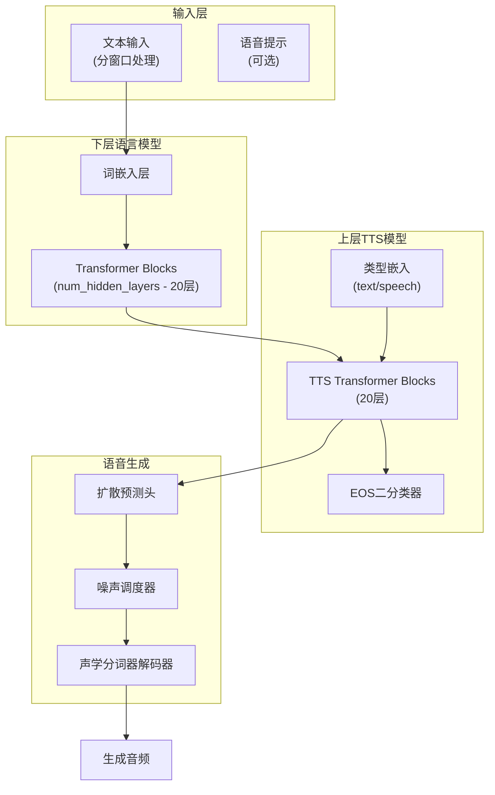
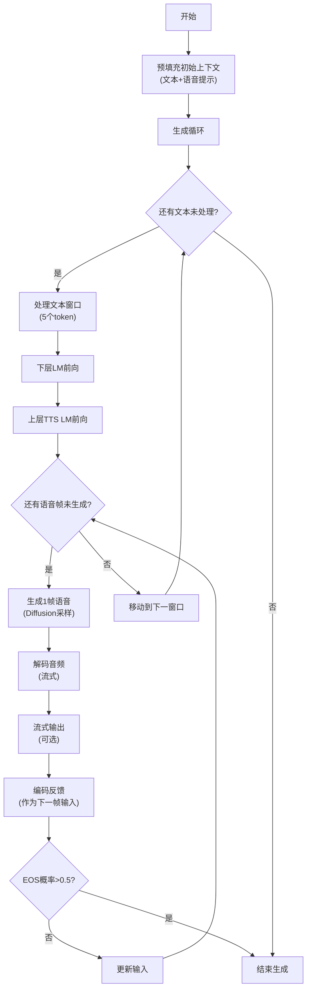
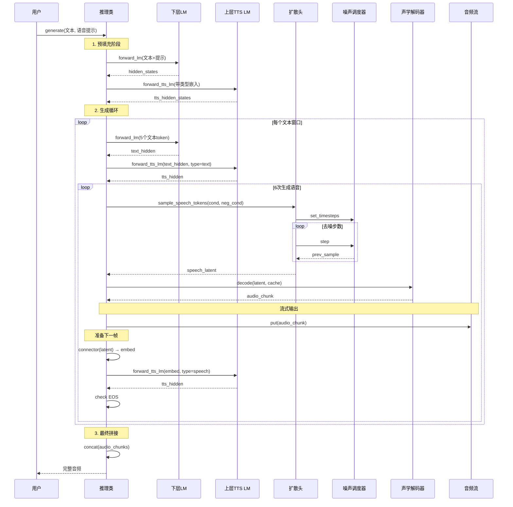

# VibeVoice 流式TTS模型详解

> 本文档详细介绍VibeVoice流式TTS模型的架构、实现原理和使用方法。流式模型是为低延迟实时语音生成场景设计的轻量级版本。

## 目录

1. [模型概述](#1-模型概述)
2. [核心架构设计](#2-核心架构设计)
3. [分层语言模型](#3-分层语言模型)
4. [类型嵌入机制](#4-类型嵌入机制)
5. [窗口式生成策略](#5-窗口式生成策略)
6. [EOS二分类器](#6-eos二分类器)
7. [推理流程](#7-推理流程)

## 1. 模型概述

VibeVoice流式TTS模型是一个专为实时语音生成优化的轻量级模型，主要特点包括：

- **规模较小**：相比完整多说话人模型（1.5B/7B），流式模型规模更精简
- **无语义分词器**：仅使用声学分词器，减少计算开销
- **分层LM设计**：将语言模型分为下层文本编码和上层TTS生成两部分
- **窗口式生成**：采用文本窗口和语音窗口交替的方式实现流式生成

**关键配置参数**（来自 `configuration_vibevoice_streaming.py`）：
```python
class VibeVoiceStreamingConfig(PretrainedConfig):
    model_type = "vibevoice_streaming"
    is_composition = True
    # 子配置
    acoustic_tokenizer_config: VibeVoiceAcousticTokenizerConfig
    decoder_config: Qwen2Config  # 语言模型配置
    diffusion_head_config: VibeVoiceDiffusionHeadConfig
    # TTS专用参数
    tts_backbone_num_hidden_layers: int = 20  # 上层TTS层数
```

## 2. 核心架构设计

### 2.1 整体架构图



### 2.2 核心组件

在 `vibevoice/modular/modeling_vibevoice_streaming.py` 中定义：

```python
class VibeVoiceStreamingModel(VibeVoiceStreamingPreTrainedModel):
    def __init__(self, config):
        super().__init__(config)
        
        # 下层语言模型（仅文本编码）
        lm_config = copy.deepcopy(config.decoder_config)
        lm_backbone_num_hidden_layers = (
            getattr(lm_config, 'num_hidden_layers', 24) 
            - config.tts_backbone_num_hidden_layers
        )
        lm_config.num_hidden_layers = lm_backbone_num_hidden_layers
        self.language_model = AutoModel.from_config(lm_config)
        self.language_model.norm = nn.Identity()  # 下层不用归一化
        
        # 上层TTS模型（文本+语音生成）
        tts_lm_config = copy.deepcopy(lm_config)
        tts_lm_config.num_hidden_layers = config.tts_backbone_num_hidden_layers
        self.tts_language_model = AutoModel.from_config(tts_lm_config)
        
        # 类型嵌入
        self.tts_input_types = nn.Embedding(
            num_embeddings=2, 
            embedding_dim=config.decoder_config.hidden_size
        )
        
        # 语音组件
        self.acoustic_tokenizer = AutoModel.from_config(config.acoustic_tokenizer_config)
        self.acoustic_connector = SpeechConnector(config.acoustic_vae_dim, lm_config.hidden_size)
        
        # 注册缩放因子
        self.register_buffer('speech_scaling_factor', torch.tensor(float('nan')))
        self.register_buffer('speech_bias_factor', torch.tensor(float('nan')))
        
        # 扩散头
        self.prediction_head = AutoModel.from_config(config.diffusion_head_config)
        
        # 噪声调度器
        self.noise_scheduler = DPMSolverMultistepScheduler(
            num_train_timesteps=config.diffusion_head_config.ddpm_num_steps,
            beta_schedule=config.diffusion_head_config.ddpm_beta_schedule,
            prediction_type=config.diffusion_head_config.prediction_type
        )
```

**关键设计**：
- 下层LM的`norm`层设为`Identity`，因为不需要在下层进行最终归一化
- 上下层共享相同的词表和输入嵌入，但分别独立运行
- 类型嵌入用于标记当前位置是文本还是语音

## 3. 分层语言模型

### 3.1 下层LM（文本编码）

下层LM负责纯文本的编码，特点：
- **层数较少**：总层数 - 20层（如总28层则下层8层）
- **无最终归一化**：`self.language_model.norm = nn.Identity()`
- **仅处理文本**：不参与语音生成，只做文本特征提取

优势：
- 可以预先填充长文本上下文，减少延迟
- 独立于语音生成过程，便于优化

### 3.2 上层TTS LM

上层LM负责结合下层的文本特征和语音特征进行生成，特点：
- **固定20层**：`tts_backbone_num_hidden_layers = 20`
- **接收两种输入**：下层的文本特征 + 类型嵌入
- **输出用于两个目的**：扩散预测头和EOS分类器

### 3.3 SpeechConnector

```python
class SpeechConnector(nn.Module):
    """语音潜空间到LM隐藏空间的连接器"""
    def __init__(self, input_dim, output_dim):
        super().__init__()
        self.fc1 = nn.Linear(input_dim, output_dim)
        self.norm = LlamaRMSNorm(output_dim, eps=1e-6)
        self.fc2 = nn.Linear(output_dim, output_dim)
    
    def forward(self, features):
        x = self.fc1(features)
        x = self.norm(x)
        x = self.fc2(x)
        return x
```

结构与多说话人模型保持一致，但仅用于声学特征（无语义特征）。

## 4. 类型嵌入机制

### 4.1 设计原理

```python
# 类型嵌入定义
self.tts_input_types = nn.Embedding(
    num_embeddings=2,  # 0 = speech, 1 = text
    embedding_dim=config.decoder_config.hidden_size
)
```

类型嵌入的作用是告诉上层TTS模型当前位置处理的是文本还是语音，这对分层架构至关重要。

### 4.2 使用方式（来自推理类）

在 `vibevoice/modular/modeling_vibevoice_streaming_inference.py` 的 `forward_tts_lm` 中：

```python
def forward_tts_lm(self, ..., lm_last_hidden_state=None, tts_text_masks=None, ...):
    # 获取输入嵌入
    if inputs_embeds is None:
        inputs_embeds = self.model.get_input_embeddings()(input_ids)
    
    # 替换尾部为下层LM的输出
    start_idx = inputs_embeds.shape[1] - lm_last_hidden_state.shape[1]
    inputs_embeds[:, start_idx:, :] = lm_last_hidden_state
    
    # 添加类型嵌入
    inputs_embeds = inputs_embeds + self.model.tts_input_types(tts_text_masks.long())
    
    # 通过TTS LM
    outputs = self.model.tts_language_model(...)
    hidden_states = outputs[0] if not return_dict else outputs.last_hidden_state
    logits = self.tts_eos_classifier(hidden_states[:, -1, :])  # EOS分类
```

**关键点**：
- 下层LM的输出会替换上层输入的对应位置
- 类型嵌入会加到整个输入嵌入上
- `tts_text_masks` 是一个二值mask，1表示文本，0表示语音

## 5. 窗口式生成策略

### 5.1 窗口大小定义

在 `modeling_vibevoice_streaming_inference.py` 开头：

```python
TTS_TEXT_WINDOW_SIZE = 5      # 每次处理5个文本token
TTS_SPEECH_WINDOW_SIZE = 6    # 每次生成6帧语音（约6/7.5=0.8秒）
```

### 5.2 生成循环流程



### 5.3 代码实现（generate方法）

核心逻辑：

```python
def generate(self, ..., tts_text_ids=None, ...):
    # 初始化
    tts_text_window_index = 0
    finished_tags = torch.zeros(batch_size, dtype=torch.bool, device=device)
    audio_chunks = [[] for _ in range(batch_size)]
    
    while True:
        # 1. 处理文本窗口
        cur_input_tts_text_ids = tts_text_ids[
            :, 
            tts_text_window_index*TTS_TEXT_WINDOW_SIZE : 
            (tts_text_window_index+1)*TTS_TEXT_WINDOW_SIZE
        ]
        
        if cur_input_tts_text_ids.shape[1] > 0:
            # 通过下层LM编码文本
            model_inputs = self.prepare_inputs_for_generation(input_ids, ...)
            outputs = self.forward_lm(**model_inputs, ...)
            model_kwargs = _update_model_kwargs_for_generation(
                outputs, model_kwargs, num_new_tokens=next_text_window_size
            )
            
            # 通过上层TTS LM
            tts_lm_model_inputs = self.prepare_inputs_for_generation(tts_lm_input_ids, ...)
            tts_lm_additional_inputs = {
                "tts_text_masks": torch.ones_like(tts_lm_input_ids[:, -1:]),
                "lm_last_hidden_state": outputs.last_hidden_state,
            }
            tts_lm_outputs = self.forward_tts_lm(
                **tts_lm_model_inputs, **tts_lm_additional_inputs, ...
            )
            tts_lm_model_kwargs = self._update_model_kwargs_for_generation(
                tts_lm_outputs, tts_lm_model_kwargs, ...
            )
            
            tts_text_window_index += 1
        
        # 2. 生成语音窗口（6帧）
        for cur_speech_index in range(TTS_SPEECH_WINDOW_SIZE):
            # CFG采样语音潜变量
            speech_latent = self.sample_speech_tokens(
                positive_condition=tts_lm_outputs.last_hidden_state[diffusion_indices, -1, :],
                negative_condition=tts_lm_negative_outputs.last_hidden_state[diffusion_indices, -1, :],
                cfg_scale=cfg_scale,
            ).unsqueeze(1)
            
            # 解码音频
            scaled_latent = speech_latent / self.model.speech_scaling_factor - self.model.speech_bias_factor
            audio_chunk = self.model.acoustic_tokenizer.decode(
                scaled_latent,
                cache=acoustic_cache,  # 使用流式缓存
                sample_indices=diffusion_indices,
                use_cache=True,
            )
            
            # 保存音频块
            for i, sample_idx in enumerate(diffusion_indices):
                if not finished_tags[sample_idx]:
                    audio_chunks[sample_idx].append(audio_chunk[i])
            
            # 流式输出（如果有）
            if audio_streamer is not None:
                audio_streamer.put(audio_chunk, diffusion_indices)
            
            # 准备下一帧输入（声学特征作为反馈）
            acoustic_embed = self.model.acoustic_connector(speech_latent)
            
            # 通过上层TTS LM（语音位置）
            tts_lm_input_ids = torch.cat([tts_lm_input_ids, torch.ones_like(tts_lm_input_ids[:, -1:])], dim=-1)
            tts_lm_model_inputs = self.prepare_inputs_for_generation(tts_lm_input_ids, ...)
            tts_lm_additional_inputs = {
                "tts_text_masks": torch.zeros_like(tts_lm_input_ids[:, -1:]),  # speech = 0
                "lm_last_hidden_state": acoustic_embed,
            }
            tts_lm_outputs = self.forward_tts_lm(
                **tts_lm_model_inputs, **tts_lm_additional_inputs, ...
            )
            
            # EOS判断
            tts_eos_logits = torch.sigmoid(self.tts_eos_classifier(
                tts_lm_outputs.last_hidden_state[diffusion_indices, -1, :]
            ))
            if tts_eos_logits[0].item() > 0.5:
                finished_tags[diffusion_indices] = True
                if audio_streamer is not None:
                    audio_streamer.end(diffusion_indices)
                break
        
        # 检查是否完成
        if finished_tags.all() or (tts_text_window_index*TTS_TEXT_WINDOW_SIZE >= tts_text_ids.shape[1]):
            break
    
    # 拼接最终音频
    final_audio_outputs = []
    for sample_chunks in audio_chunks:
        if sample_chunks:
            concatenated_audio = torch.cat(sample_chunks, dim=-1)
            final_audio_outputs.append(concatenated_audio)
        else:
            final_audio_outputs.append(None)
    
    return VibeVoiceGenerationOutput(
        sequences=tts_lm_input_ids,
        speech_outputs=final_audio_outputs,
        ...
    )
```

## 6. EOS二分类器

### 6.1 设计原理

EOS二分类器用于判断语音生成何时应该自然结束，而不是生硬地截断。

```python
class BinaryClassifier(nn.Module):
    """二分类器用于流式TTS的EOS检测"""
    def __init__(self, hidden_size):
        super(BinaryClassifier, self).__init__()
        self.fc1 = nn.Linear(hidden_size, hidden_size)
        self.fc2 = nn.Linear(hidden_size, 1)
    
    def forward(self, x):
        x = torch.relu(self.fc1(x))
        x = self.fc2(x)
        return x
```

### 6.2 使用方式

在推理时：

```python
# 计算EOS概率
tts_eos_logits = torch.sigmoid(self.tts_eos_classifier(
    tts_lm_outputs.last_hidden_state[diffusion_indices, -1, :]
))

# 判断是否结束
if tts_eos_logits[0].item() > 0.5:
    finished_tags[diffusion_indices] = True
    if audio_streamer is not None:
        audio_streamer.end(diffusion_indices)
```

**设计优势**：
- 轻量级：仅两层MLP
- 与语言模型解耦：可以独立调整判断阈值
- 自然结束：根据上下文语义判断何时停止，而不是固定长度

## 7. 推理流程

### 7.1 完整流程图



### 7.2 关键方法详解

#### sample_speech_tokens（CFG采样）

```python
@torch.no_grad()
def sample_speech_tokens(self, condition, neg_condition, cfg_scale=3.0):
    """带CFG的扩散采样"""
    self.model.noise_scheduler.set_timesteps(self.ddpm_inference_steps)
    
    # 拼接正负条件
    condition = torch.cat([condition, neg_condition], dim=0).to(self.model.prediction_head.device)
    
    # 初始化噪声
    speech = torch.randn(condition.shape[0], self.config.acoustic_vae_dim).to(condition)
    
    # DPM-Solver去噪循环
    for t in self.model.noise_scheduler.timesteps:
        half = speech[: len(speech) // 2]
        combined = torch.cat([half, half], dim=0)
        
        # 同时预测正负条件
        eps = self.model.prediction_head(combined, t.repeat(combined.shape[0]).to(combined), condition=condition)
        cond_eps, uncond_eps = torch.split(eps, len(eps) // 2, dim=0)
        
        # CFG公式
        half_eps = uncond_eps + cfg_scale * (cond_eps - uncond_eps)
        eps = torch.cat([half_eps, half_eps], dim=0)
        
        # 去噪一步
        speech = self.model.noise_scheduler.step(eps, t, speech).prev_sample
    
    return speech[: len(speech) // 2]
```

#### forward_lm（下层LM前向）

```python
def forward_lm(self, input_ids=None, attention_mask=None, ...):
    """下层纯文本LM前向"""
    if inputs_embeds is None:
        inputs_embeds = self.model.get_input_embeddings()(input_ids)
    
    outputs = self.model.language_model(
        inputs_embeds=inputs_embeds,
        attention_mask=attention_mask,
        ...
    )
    
    hidden_states = outputs[0] if not return_dict else outputs.last_hidden_state
    return BaseModelOutputWithPast(
        past_key_values=outputs.past_key_values,
        last_hidden_state=hidden_states,
        ...
    )
```

#### forward_tts_lm（上层TTS LM前向）

```python
def forward_tts_lm(self, input_ids=None, lm_last_hidden_state=None, tts_text_masks=None, ...):
    """上层TTS LM前向，包含类型嵌入和EOS分类"""
    if inputs_embeds is None:
        inputs_embeds = self.model.get_input_embeddings()(input_ids)
    
    # 替换尾部为下层LM输出
    start_idx = inputs_embeds.shape[1] - lm_last_hidden_state.shape[1]
    inputs_embeds[:, start_idx:, :] = lm_last_hidden_state
    
    # 添加类型嵌入
    inputs_embeds = inputs_embeds + self.model.tts_input_types(tts_text_masks.long())
    
    outputs = self.model.tts_language_model(...)
    hidden_states = outputs[0] if not return_dict else outputs.last_hidden_state
    
    # EOS分类
    logits = self.tts_eos_classifier(hidden_states[:, -1, :])
    
    return VibeVoiceCausalLMOutputWithPast(
        logits=logits,
        past_key_values=outputs.past_key_values,
        last_hidden_state=hidden_states,
        ...
    )
```

## 8. 与多说话人模型对比

| 特性 | 多说话人模型 | 流式模型 |
|------|------------|---------|
| 模型规模 | 1.5B/7B | 较小（约0.5B） |
| 分词器 | 声学+语义 | 仅声学 |
| LM架构 | 完整单层 | 分层（下层+上层） |
| EOS检测 | Token预测 | 二分类器 |
| 类型嵌入 | 无 | 有（text/speech） |
| 生成方式 | 逐token自回归 | 窗口式（5文本+6语音） |
| 多说话人 | 支持 | 仅单人 |
| 流式友好 | 一般 | 原生支持 |
| 延迟 | 较高 | 较低 |

## 9. 使用注意事项

1. **批次大小限制**：当前实现仅支持batch_size=1
2. **文本窗口大小**：TTS_TEXT_WINDOW_SIZE=5，可根据需要调整
3. **CFG缩放因子**：默认cfg_scale=3.0，越高越贴近文本但可能降低多样性
4. **流式缓存**：必须使用VibeVoiceTokenizerStreamingCache来维护解码器状态
5. **EOS阈值**：默认0.5，可根据需要调整（阈值越高越不容易结束）
