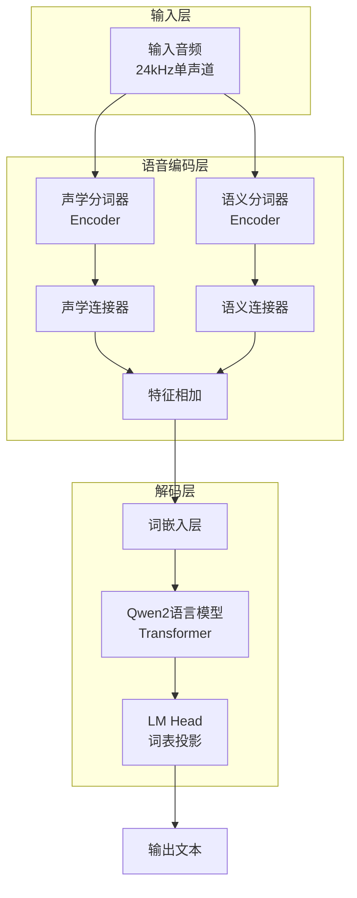
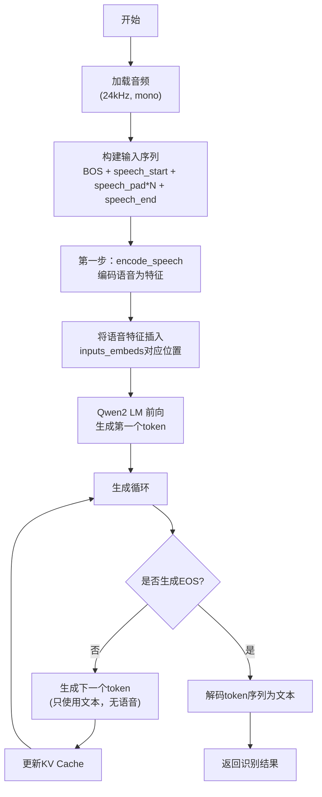

# VibeVoice ASR模型详解

> 本文档详细介绍VibeVoice自动语音识别（ASR）模型的架构、实现原理和使用方法。ASR模型将音频转换为文本，是多模态能力的重要组成部分。

## 目录

1. [模型概述](#1-模型概述)
2. [核心架构设计](#2-核心架构设计)
3. [语音编码方法](#3-语音编码方法)
4. [前向传播流程](#4-前向传播流程)
5. [文本生成推理](#5-文本生成推理)
6. [长音频流式处理](#6-长音频流式处理)
7. [与TTS模型对比](#7-与tts模型对比)

## 1. 模型概述

VibeVoice ASR模型是一个编码器-解码器结构的语音识别系统，主要特点包括：

- **双分词器编码**：使用声学分词器和语义分词器共同编码语音
- **Qwen2解码器**：基于Qwen2大语言模型作为解码器生成文本
- **无需对齐**：端到端训练，不需要音素级对齐
- **长音频支持**：支持流式处理超长音频（超过60秒）

**关键配置参数**（来自 `configuration_vibevoice.py`）：
```python
class VibeVoiceASRConfig(PretrainedConfig):
    model_type = "vibevoice_asr"
    is_composition = True
    # 子配置
    acoustic_tokenizer_config: VibeVoiceAcousticTokenizerConfig
    semantic_tokenizer_config: VibeVoiceSemanticTokenizerConfig
    decoder_config: Qwen2Config
```

## 2. 核心架构设计

### 2.1 整体架构图



### 2.2 核心组件

在 `vibevoice/modular/modeling_vibevoice_asr.py` 中定义：

```python
class VibeVoiceASRModel(VibeVoiceASRPreTrainedModel):
    def __init__(self, config):
        super().__init__(config)
        
        # 初始化Qwen2语言模型作为解码器
        self.language_model = AutoModel.from_config(config.decoder_config)
        
        # 初始化语音分词器
        self.acoustic_tokenizer = AutoModel.from_config(config.acoustic_tokenizer_config)
        self.semantic_tokenizer = AutoModel.from_config(config.semantic_tokenizer_config)
        
        # 语音连接器
        self.acoustic_connector = SpeechConnector(config.acoustic_vae_dim, config.decoder_config.hidden_size)
        self.semantic_connector = SpeechConnector(config.semantic_vae_dim, config.decoder_config.hidden_size)
```

**关键设计**：
- ASR模型同样使用双分词器设计，但与TTS方向相反
- 两个分词器的输出通过连接器映射到LM隐藏空间后相加
- 使用Qwen2作为解码器进行自回归文本生成

### 2.3 SpeechConnector

与TTS模型相同的连接器：

```python
class SpeechConnector(nn.Module):
    """语音潜空间到LM隐藏空间的连接器"""
    def __init__(self, input_dim, output_dim):
        super().__init__()
        self.fc1 = nn.Linear(input_dim, output_dim)
        self.norm = LlamaRMSNorm(output_dim, eps=1e-6)
        self.fc2 = nn.Linear(output_dim, output_dim)
    
    def forward(self, features):
        x = self.fc1(features)
        x = self.norm(x)
        x = self.fc2(x)
        return x
```

## 3. 语音编码方法

### 3.1 encode_speech方法详解

`encode_speech` 是ASR模型的核心方法，负责将音频转换为LM可用的特征：

```python
def encode_speech(
    self,
    speech_tensors: torch.FloatTensor,
    speech_masks: Optional[torch.BoolTensor] = None,
    speech_semantic_tensors: Optional[torch.FloatTensor] = None,
    streaming_segment_duration: float = 60.0,  # seconds
):
    """
    编码语音输入为特征，支持长音频流式处理
    
    Args:
        speech_tensors: 输入音频 [batch_size, samples]
        speech_masks: 可选的语音mask
        speech_semantic_tensors: 可选的预计算语义特征
        streaming_segment_duration: 流式处理的分段时长（秒）
    """
    if hasattr(self.config, 'torch_dtype') and self.config.torch_dtype is not None:
        if isinstance(self.config.torch_dtype, str):
            dtype = getattr(torch, self.config.torch_dtype)
        else:
            dtype = self.config.torch_dtype
    else:
        dtype = torch.float32
    
    speech_tensors = speech_tensors.to(dtype)
    
    # 确保形状正确 [batch, samples]
    if speech_tensors.ndim == 1:
        speech_tensors = speech_tensors.unsqueeze(0)
    
    batch_size, total_samples = speech_tensors.shape
    sample_rate = 24000  # 固定24kHz采样率
    
    # 计算分段大小
    segment_samples = int(streaming_segment_duration * sample_rate)
    
    # 判断是否需要流式处理
    use_streaming = total_samples > segment_samples
```

### 3.2 短音频直接处理

对于较短的音频（≤60秒），直接进行编码：

```python
with torch.no_grad():
    if not use_streaming:
        # 短音频：直接处理
        encoder_output = self.model.acoustic_tokenizer.encode(speech_tensors.unsqueeze(1))
        audio_tokens = encoder_output.sample(dist_type=self.model.acoustic_tokenizer.std_dist_type)[0]
        acoustic_features = self.model.acoustic_connector(audio_tokens)
        
        # 编码语义特征
        if speech_semantic_tensors is not None:
            semantic_features = self.model.semantic_connector(speech_semantic_tensors)
        else:
            semantic_tokens = self.model.semantic_tokenizer.encode(speech_tensors.unsqueeze(1)).mean
            semantic_features = self.model.semantic_connector(semantic_tokens)
```

### 3.3 长音频流式处理

对于超过60秒的长音频，采用分段处理策略：

```python
else:
    # 长音频：流式处理
    # 初始化流式缓存
    acoustic_encoder_cache = VibeVoiceTokenizerStreamingCache()
    semantic_encoder_cache = VibeVoiceTokenizerStreamingCache()
    acoustic_mean_segments = []
    semantic_mean_segments = []
    sample_indices = torch.arange(batch_size, device=speech_tensors.device)
    
    # 定义分段迭代器
    def _iter_segments(total_length: int, segment_length: int):
        for start in range(0, total_length, segment_length):
            end = min(start + segment_length, total_length)
            if end > start:
                yield start, end
    
    # 处理每个分段
    segments = list(_iter_segments(total_samples, segment_samples))
    num_segments = len(segments)
    for seg_idx, (start, end) in enumerate(segments):
        chunk = speech_tensors[:, start:end].contiguous()
        if chunk.numel() == 0:
            continue
        
        # 判断是否是最后一个分段
        is_final = (seg_idx == num_segments - 1)
        
        # 编码声学特征（暂不采样）
        acoustic_encoder_output = self.model.acoustic_tokenizer.encode(
            chunk.unsqueeze(1),
            cache=acoustic_encoder_cache,
            sample_indices=sample_indices,
            use_cache=True,
            is_final_chunk=is_final,
        )
        acoustic_mean_segments.append(acoustic_encoder_output.mean)
        
        # 编码语义特征（取均值）
        semantic_encoder_output = self.model.semantic_tokenizer.encode(
            chunk.unsqueeze(1),
            cache=semantic_encoder_cache,
            sample_indices=sample_indices,
            use_cache=True,
            is_final_chunk=is_final,
        )
        semantic_mean_segments.append(semantic_encoder_output.mean)
    
    # 拼接所有分段的特征
    acoustic_mean_full = torch.cat(acoustic_mean_segments, dim=1).contiguous()
    acoustic_encoder_output = VibeVoiceTokenizerEncoderOutput(
        mean=acoustic_mean_full,
        std=self.model.acoustic_tokenizer.fix_std
    )
    audio_tokens = acoustic_encoder_output.sample(
        dist_type=self.model.acoustic_tokenizer.std_dist_type
    )[0]
    acoustic_features = self.model.acoustic_connector(audio_tokens)
    
    # 拼接语义特征
    semantic_tokens = torch.cat(semantic_mean_segments, dim=1).contiguous()
    semantic_features = self.model.semantic_connector(semantic_tokens)
```

### 3.4 特征融合

无论长短音频，最后都需要将声学和语义特征融合：

```python
# 合并声学和语义特征
if speech_masks is not None:
    combined_features = acoustic_features[speech_masks] + semantic_features[speech_masks]
else:
    combined_features = acoustic_features + semantic_features

return combined_features
```

**设计优势**：
- 分段处理避免了长音频的内存溢出问题
- 使用流式缓存保持分段之间的连续性
- 最后拼接后再采样，保证特征的一致性

## 4. 前向传播流程

### 4.1 forward方法

```python
def forward(
    self,
    input_ids: Optional[torch.LongTensor] = None,
    attention_mask: Optional[torch.Tensor] = None,
    position_ids: Optional[torch.LongTensor] = None,
    past_key_values: Optional[List[torch.FloatTensor]] = None,
    inputs_embeds: Optional[torch.FloatTensor] = None,
    labels: Optional[torch.LongTensor] = None,
    use_cache: Optional[bool] = None,
    output_attentions: Optional[bool] = None,
    output_hidden_states: Optional[bool] = None,
    return_dict: Optional[bool] = None,
    cache_position: Optional[torch.LongTensor] = None,
    # ASR特定参数
    speech_tensors: Optional[torch.FloatTensor] = None,
    speech_masks: Optional[torch.BoolTensor] = None,
    speech_semantic_tensors: Optional[torch.FloatTensor] = None,
    acoustic_input_mask: Optional[torch.BoolTensor] = None,
    **kwargs,
):
    """
    ASR模型前向传播
    
    主要流程：
    1. 如果有speech_tensors，先用encode_speech编码
    2. 将语音特征插入到inputs_embeds的对应位置
    3. 通过Qwen2 LM进行前向传播
    4. 如果有labels，计算交叉熵损失
    """
    output_attentions = output_attentions if output_attentions is not None else self.config.output_attentions
    output_hidden_states = output_hidden_states if output_hidden_states is not None else self.config.output_hidden_states
    return_dict = return_dict if return_dict is not None else self.config.use_return_dict
    use_cache = use_cache if use_cache is not None else self.config.use_cache

    # 处理输入嵌入
    if inputs_embeds is None and input_ids is not None:
        inputs_embeds = self.get_input_embeddings()(input_ids)
    
    # 如果有语音输入和mask，编码语音并插入
    if speech_tensors is not None and acoustic_input_mask is not None:
        speech_features = self.encode_speech(
            speech_tensors=speech_tensors,
            speech_masks=speech_masks,
            speech_semantic_tensors=speech_semantic_tensors,
        )
        inputs_embeds[acoustic_input_mask] = speech_features

    # 通过语言模型
    outputs = self.model(
        input_ids=None,
        attention_mask=attention_mask,
        position_ids=position_ids,
        past_key_values=past_key_values,
        inputs_embeds=inputs_embeds,
        use_cache=use_cache,
        output_attentions=output_attentions,
        output_hidden_states=output_hidden_states,
        return_dict=return_dict,
        cache_position=cache_position,
    )

    hidden_states = outputs[0] if not return_dict else outputs.last_hidden_state
    logits = self.lm_head(hidden_states)

    loss = None
    if labels is not None:
        # 移位，使tokens < n 预测 n
        shift_logits = logits[..., :-1, :].contiguous()
        shift_labels = labels[..., 1:].contiguous()
        # 展平
        loss_fct = nn.CrossEntropyLoss()
        shift_logits = shift_logits.view(-1, self.vocab_size)
        shift_labels = shift_labels.view(-1)
        # 启用模型并行
        shift_labels = shift_labels.to(shift_logits.device)
        loss = loss_fct(shift_logits, shift_labels)

    if not return_dict:
        output = (logits,) + outputs[1:]
        return (loss,) + output if loss is not None else output

    return VibeVoiceCausalLMOutputWithPast(
        loss=loss,
        logits=logits,
        past_key_values=outputs.past_key_values,
        hidden_states=outputs.hidden_states,
        attentions=outputs.attentions,
    )
```

### 4.2 输入格式

ASR模型的输入需要按照特定格式组织：

```
[BOS] [speech_start] [speech_pad] * N [speech_end] [文本...]
```

- `BOS`：开始标记
- `speech_start/speech_end`：语音段标记
- `speech_pad`：语音占位符，会被替换为真实语音特征
- `文本...`：训练时的目标文本，推理时为空

## 5. 文本生成推理

### 5.1 prepare_inputs_for_generation

为了适配生成过程，ASR模型实现了自定义的输入准备方法：

```python
def prepare_inputs_for_generation(
    self,
    input_ids,
    past_key_values=None,
    attention_mask=None,
    inputs_embeds=None,
    cache_position=None,
    position_ids=None,
    use_cache=True,
    speech_tensors=None,
    speech_masks=None,
    speech_semantic_tensors=None,
    acoustic_input_mask=None,
    **kwargs,
):
    """
    准备生成所需的输入
    
    关键设计：只在第一步（cache_position[0] == 0）时处理语音
    后续步骤只处理文本token
    """
    if past_key_values is not None:
        if isinstance(past_key_values, tuple):
            past_length = past_key_values[0][0].shape[2]
        else:
            past_length = past_key_values.get_seq_length()
        
        # 只保留新token
        if input_ids is not None and input_ids.shape[1] > past_length:
            input_ids = input_ids[:, past_length:]

    # 准备position ids
    if position_ids is None and attention_mask is not None:
        position_ids = attention_mask.long().cumsum(-1) - 1
        position_ids.masked_fill_(attention_mask == 0, 1)
        if past_key_values is not None and input_ids is not None:
            position_ids = position_ids[:, -input_ids.shape[1]:]

    # 准备cache position
    if cache_position is None:
        past_seen_tokens = past_key_values.get_seq_length() if past_key_values is not None else 0
        cache_position = torch.arange(
            past_seen_tokens, 
            past_seen_tokens + (input_ids.shape[1] if input_ids is not None else inputs_embeds.shape[1]), 
            device=input_ids.device if input_ids is not None else inputs_embeds.device
        )

    # 准备模型输入
    if inputs_embeds is not None and past_key_values is None:
        model_inputs = {"inputs_embeds": inputs_embeds}
    else:
        model_inputs = {"input_ids": input_ids}

    model_inputs.update({
        "position_ids": position_ids,
        "cache_position": cache_position,
        "past_key_values": past_key_values,
        "use_cache": use_cache,
        "attention_mask": attention_mask,
    })
    
    # 关键：只在第一步包含语音输入
    if cache_position is not None and len(cache_position) > 0 and cache_position[0] == 0:
        model_inputs.update({
            "speech_tensors": speech_tensors,
            "speech_masks": speech_masks,
            "speech_semantic_tensors": speech_semantic_tensors,
            "acoustic_input_mask": acoustic_input_mask,
        })
    else:
        # 后续步骤不包含语音
        model_inputs.update({
            "speech_tensors": None,
            "speech_masks": None,
            "speech_semantic_tensors": None,
            "acoustic_input_mask": None,
        })
    
    model_inputs.update(kwargs)
    return model_inputs
```

### 5.2 完整推理流程



## 6. 长音频流式处理

### 6.1 设计原理

长音频处理的关键点：

1. **分段处理**：将长音频切分为60秒的片段
2. **流式缓存**：使用 `VibeVoiceTokenizerStreamingCache` 保存卷积状态
3. **先拼接后采样**：所有分段编码完成后再进行采样，避免误差累积

### 6.2 流式缓存机制

```python
class VibeVoiceTokenizerStreamingCache:
    """语音分词器的流式缓存
    
    存储每个卷积层的历史状态，使分段处理保持连续性
    """
    def __init__(self):
        self.cache = {}  # {(layer_id, sample_idx): tensor}
    
    def get(self, layer_id: str, sample_indices: torch.Tensor):
        """获取缓存"""
        ...
    
    def set(self, layer_id: str, sample_indices: torch.Tensor, states: torch.Tensor):
        """设置缓存"""
        ...
```

### 6.3 is_final_chunk标记

```python
# 在encode时标记最后一个分段
is_final = (seg_idx == num_segments - 1)

acoustic_encoder_output = self.model.acoustic_tokenizer.encode(
    chunk.unsqueeze(1),
    cache=acoustic_encoder_cache,
    sample_indices=sample_indices,
    use_cache=True,
    is_final_chunk=is_final,  # 重要！
)
```

这个标记告诉分词器在最后一个分段时进行必要的清理操作。

## 7. 与TTS模型对比

| 特性 | TTS模型 | ASR模型 |
|------|---------|---------|
| 输入 | 文本 + 语音提示 | 音频 + 提示文本 |
| 输出 | 音频 | 文本 |
| 分词器使用 | 声学Decoder（生成）+ 语义Encoder（反馈） | 声学Encoder + 语义Encoder（都用于编码） |
| 特殊token | speech_start/speech_end/speech_diffusion | speech_start/speech_end/speech_pad |
| 生成分支 | LM Head + Diffusion Head | 只有LM Head |
| 长音频处理 | 分段生成 | 分段编码 |
| 缩放因子 | 需要（声学特征归一化） | 不需要（直接编码） |

## 8. 使用示例

### 8.1 基本使用

```python
from vibevoice.modular import VibeVoiceASRForConditionalGeneration
from vibevoice.processor import VibeVoiceASRProcessor

# 加载模型和处理器
model = VibeVoiceASRForConditionalGeneration.from_pretrained("path/to/model")
processor = VibeVoiceASRProcessor.from_pretrained("path/to/model")

# 加载音频
audio, sr = librosa.load("audio.wav", sr=24000)

# 处理输入
inputs = processor(audio=audio, return_tensors="pt")

# 生成文本
with torch.no_grad():
    outputs = model.generate(**inputs)

# 解码
text = processor.decode(outputs[0], skip_special_tokens=True)
print(text)
```

### 8.2 长音频处理

```python
# 对于长音频，无需特殊设置，encode_speech会自动处理
audio, sr = librosa.load("long_audio.wav", sr=24000)  # 例如10分钟

inputs = processor(audio=audio, return_tensors="pt")

# 生成时会自动使用流式编码
with torch.no_grad():
    outputs = model.generate(**inputs, max_new_tokens=1000)

text = processor.decode(outputs[0], skip_special_tokens=True)
```

## 9. 使用注意事项

1. **采样率**：必须使用24kHz采样率的音频
2. **音频格式**：单声道，浮点型（-1.0到1.0）
3. **长音频分段**：默认60秒一段，可通过`streaming_segment_duration`调整
4. **生成长度**：长音频需要设置足够的`max_new_tokens`
5. **内存管理**：非常长的音频建议分批处理
6. **语音提示**：虽然ASR主要是语音转文本，但也可以像TTS一样使用语音提示
