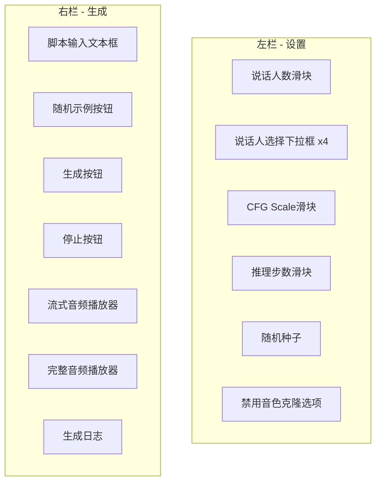

# 推理流程与Demo详解

## 一、整体推理架构

VibeVoice的推理流程采用了模块化设计,将文本处理、语音提示编码、自回归生成和扩散采样有机结合在一起。

```mermaid
flowchart TD
    A[用户输入] --&gt; B[文本分词器]
    C[语音提示] --&gt; D[音频处理器]
    D --&gt; E[声学分词器]
    E --&gt; F[语义分词器]
    F --&gt; G[Speech Connector]
    G --&gt; H[输入嵌入融合]
    B --&gt; H
    
    H --&gt; I[Qwen2语言模型]
    I --&gt; J[Token预测]
    
    J --&gt; K{Token类型?}
    K --&gt;|&lt;SPEECH_START&gt;| L[初始化扩散采样]
    K --&gt;|&lt;SPEECH_DIFFUSION&gt;| M[CFG扩散采样]
    K --&gt;|&lt;SPEECH_END&gt;| N[重置缓存]
    K --&gt;|文本Token| O[继续生成]
    
    M --&gt; P[VAE解码]
    P --&gt; Q[音频块]
    Q --&gt; R[AudioStreamer]
    R --&gt; S[实时播放]
    
    L --&gt; M
    O --&gt; J
    N --&gt; J
```

## 二、推理核心模块

### 2.1 模型加载与初始化

在 [`demo/gradio_demo.py`](file:///workspace/demo/gradio_demo.py) 中,`VibeVoiceDemo.load_model()` 方法展示了完整的加载流程:

```python
def load_model(self):
    # 1. 加载处理器
    self.processor = VibeVoiceProcessor.from_pretrained(self.model_path)
    
    # 2. 根据设备选择dtype和attention实现
    if self.device == "mps":
        load_dtype = torch.float32
        attn_impl_primary = "sdpa"
    elif self.device == "cuda":
        load_dtype = torch.bfloat16
        attn_impl_primary = "flash_attention_2"
    else:
        load_dtype = torch.float32
        attn_impl_primary = "sdpa"
    
    # 3. 加载推理模型
    self.model = VibeVoiceForConditionalGenerationInference.from_pretrained(
        self.model_path,
        torch_dtype=load_dtype,
        device_map=self.device,
        attn_implementation=attn_impl_primary,
    )
    
    # 4. 加载LoRA适配器(如果提供)
    if self.adapter_path:
        report = load_lora_assets(self.model, self.adapter_path)
    
    # 5. 设置噪声调度器
    self.model.model.noise_scheduler = self.model.model.noise_scheduler.from_config(
        self.model.model.noise_scheduler.config, 
        algorithm_type='sde-dpmsolver++',
        beta_schedule='squaredcos_cap_v2'
    )
    
    # 6. 设置推理步数
    self.model.set_ddpm_inference_steps(num_steps=self.inference_steps)
```

### 2.2 处理器预处理

主处理器负责将文本脚本和语音样本转换为模型输入:

```python
inputs = self.processor(
    text=[formatted_script],
    voice_samples=[voice_samples] if voice_samples is not None else None,
    padding=True,
    return_tensors="pt",
    return_attention_mask=True,
)
```

处理后的输入包含:
- `input_ids`: 文本Token ID序列
- `attention_mask`: 注意力掩码
- `speech_tensors`: 语音张量(如果提供了语音样本)
- `speech_masks`: 语音掩码
- `speech_input_mask`: 标记哪些位置是语音占位符

## 三、流式推理生成

### 3.1 生成流程图

```mermaid
sequenceDiagram
    participant U as 用户
    participant D as Demo
    participant P as Processor
    participant M as Model
    participant S as Streamer
    participant O as Audio Output
    
    U-&gt;&gt;D: 输入脚本 + 选择声音
    D-&gt;&gt;P: 处理输入
    P-&gt;&gt;D: 返回input_ids等
    D-&gt;&gt;S: 初始化AudioStreamer
    D-&gt;&gt;M: 调用generate()
    activate M
    loop 生成循环
        M-&gt;&gt;M: 预测下一个Token
        alt Token == &lt;SPEECH_DIFFUSION&gt;
            M-&gt;&gt;M: CFG扩散采样
            M-&gt;&gt;M: VAE解码到音频
            M-&gt;&gt;S: put(audio_chunk)
            S-&gt;&gt;O: yield audio
        end
    end
    M-&gt;&gt;S: end()
    deactivate M
    O-&gt;&gt;U: 播放完成音频
```

### 3.2 核心生成代码

在 [`demo/gradio_demo.py`](file:///workspace/demo/gradio_demo.py) 中,`_generate_with_streamer()` 方法:

```python
def _generate_with_streamer(
    self,
    inputs,
    cfg_scale,
    audio_streamer,
    voice_cloning_enabled,
    inference_steps,
    seed,
    target_device,
):
    # 设置推理步数
    self.model.set_ddpm_inference_steps(num_steps=int(inference_steps))
    
    # 随机种子生成器
    generator = None
    if seed is not None:
        generator = torch.Generator(device=target_device)
        generator.manual_seed(int(seed))
    
    # 调用模型生成
    outputs = self.model.generate(
        **inputs,
        max_new_tokens=None,
        cfg_scale=cfg_scale,
        tokenizer=self.processor.tokenizer,
        generation_config={'do_sample': False},
        generator=generator,
        audio_streamer=audio_streamer,  # 关键:传入streamer
        stop_check_fn=check_stop_generation,
        is_prefill=voice_cloning_enabled,
    )
```

### 3.3 模型内的生成流程

在 [`vibevoice/modular/modeling_vibevoice_inference.py`](file:///workspace/vibevoice/modular/modeling_vibevoice_inference.py) 中:

```python
@torch.no_grad()
def generate(self, inputs, ..., audio_streamer=None, cfg_scale=1.0, ...):
    # 1. 初始化
    acoustic_cache = VibeVoiceTokenizerStreamingCache()
    semantic_cache = VibeVoiceTokenizerStreamingCache()
    audio_chunks = [[] for _ in range(batch_size)]
    
    # 2. 生成循环
    while not finished_tags.all():
        # 2.1 模型前向
        outputs = self(**model_inputs, ...)
        
        # 2.2 选择下一个Token
        next_tokens = torch.argmax(next_token_scores, dim=-1)
        
        # 2.3 处理 &lt;SPEECH_DIFFUSION&gt; Token
        diffusion_indices = next_tokens == speech_diffusion_id
        if diffusion_indices.numel() &gt; 0:
            # CFG采样
            speech_latent = self.sample_speech_tokens(
                positive_condition, negative_condition, cfg_scale
            )
            
            # VAE解码
            scaled_latent = speech_latent / self.speech_scaling_factor - self.speech_bias_factor
            audio_chunk = self.acoustic_tokenizer.decode(
                scaled_latent, cache=acoustic_cache, sample_indices=diffusion_indices
            )
            
            # 存储音频块
            for i, sample_idx in enumerate(diffusion_indices):
                audio_chunks[sample_idx.item()].append(audio_chunk[i])
            
            # 流式输出
            if audio_streamer is not None:
                audio_streamer.put(audio_chunk, diffusion_indices)
            
            # 重新编码以获得语义特征(用于下一步)
            semantic_features = self.semantic_tokenizer.encode(
                audio_chunk, cache=semantic_cache, sample_indices=diffusion_indices
            ).mean
            
            # 准备下一个输入嵌入
            acoustic_embed = self.acoustic_connector(speech_latent)
            semantic_embed = self.semantic_connector(semantic_features)
            diffusion_embeds = acoustic_embed + semantic_embed
            next_inputs_embeds[diffusion_indices] = diffusion_embeds
        
        # 2.4 更新状态
        input_ids = torch.cat([input_ids, next_tokens[:, None]], dim=-1)
        inputs_embeds = next_inputs_embeds
    
    # 3. 结束流式
    if audio_streamer is not None:
        audio_streamer.end()
    
    # 4. 拼接完整音频
    final_audio_outputs = []
    for sample_chunks in audio_chunks:
        if sample_chunks:
            concatenated_audio = torch.cat(sample_chunks, dim=-1)
            final_audio_outputs.append(concatenated_audio)
    
    return VibeVoiceGenerationOutput(
        sequences=input_ids,
        speech_outputs=final_audio_outputs,
    )
```

## 四、CFG采样详解

### 4.1 CFG原理

Classifier-Free Guidance 通过对比有条件和无条件的预测结果来提升生成质量:

```python
def sample_speech_tokens(self, condition, neg_condition, cfg_scale=3.0):
    # 1. 设置时间步
    self.noise_scheduler.set_timesteps(self.ddpm_inference_steps)
    
    # 2. 拼接正负条件
    condition = torch.cat([condition, neg_condition], dim=0)
    
    # 3. 初始化随机噪声
    speech = torch.randn(condition.shape[0], self.config.acoustic_vae_dim).to(condition)
    
    # 4. 去噪循环
    for t in self.noise_scheduler.timesteps:
        # 拼接当前样本
        half = speech[: len(speech) // 2]
        combined = torch.cat([half, half], dim=0)
        
        # 模型预测
        eps = self.prediction_head(combined, t.repeat(combined.shape[0]), condition=condition)
        
        # CFG公式: eps = uncond + cfg_scale * (cond - uncond)
        cond_eps, uncond_eps = torch.split(eps, len(eps) // 2, dim=0)
        half_eps = uncond_eps + cfg_scale * (cond_eps - uncond_eps)
        eps = torch.cat([half_eps, half_eps], dim=0)
        
        # 调度器去噪一步
        speech = self.noise_scheduler.step(eps, t, speech).prev_sample
    
    # 5. 返回正条件样本
    return speech[: len(speech) // 2]
```

### 4.2 CFG Scale参数选择

| CFG Scale | 效果 | 适用场景 |
|-----------|------|----------|
| 1.0 | 无引导,最自然 | 通用场景 |
| 1.3 - 1.5 | 轻度引导,平衡质量和自然度 | 推荐默认值 |
| 2.0 - 3.0 | 较强引导,更清晰但可能生硬 | 需要高清晰度 |
| &gt;5.0 | 过强引导,可能失真 | 不推荐 |

## 五、Gradio Demo 界面设计

### 5.1 界面布局



### 5.2 界面创建代码

在 [`demo/gradio_demo.py`](file:///workspace/demo/gradio_demo.py) 的 `create_demo_interface()` 中:

```python
def create_demo_interface(demo_instance: VibeVoiceDemo):
    with gr.Blocks() as interface:
        # 标题
        gr.HTML("# VibeVoice")
        
        with gr.Row():
            # 左栏 - 设置
            with gr.Column(scale=1):
                num_speakers = gr.Slider(1, 4, value=2, step=1, label="Number of Speakers")
                
                speaker_selections = []
                for i in range(4):
                    speaker = gr.Dropdown(
                        choices=available_speaker_names,
                        label=f"Speaker {i+1}",
                        visible=(i &lt; 2)
                    )
                    speaker_selections.append(speaker)
                
                with gr.Accordion("Generation Parameters", open=False):
                    cfg_scale = gr.Slider(1.0, 12.0, value=1.3, label="CFG Scale")
                    inference_steps = gr.Slider(1, 50, value=10, label="Inference Steps")
                    seed = gr.Number(value=42, label="Seed")
                    disable_voice_cloning = gr.Checkbox(value=False, label="Disable voice cloning")
            
            # 右栏 - 生成
            with gr.Column(scale=2):
                script_input = gr.Textbox(label="Conversation Script", lines=12)
                
                with gr.Row():
                    random_example_btn = gr.Button("🎲 Random Example")
                    generate_btn = gr.Button("🚀 Generate Podcast")
                
                stop_btn = gr.Button("🛑 Stop Generation", visible=False)
                streaming_status = gr.HTML(visible=False)
                
                audio_output = gr.Audio(label="Streaming Audio", streaming=True, autoplay=True)
                complete_audio_output = gr.Audio(label="Complete Podcast", type="filepath", visible=False)
                
                log_output = gr.Textbox(label="Generation Log", interactive=False)
        
        # 绑定事件
        generate_btn.click(...).then(...)
        stop_btn.click(...)
    
    return interface
```

## 六、运行Demo

### 6.1 启动命令

```bash
# 基本启动
python -m demo.gradio_demo \
    --model_path /path/to/vibevoice-model

# 完整参数
python -m demo.gradio_demo \
    --model_path /path/to/vibevoice-model \
    --device cuda \
    --inference_steps 10 \
    --port 7860 \
    --share \
    --checkpoint_path /path/to/lora-adapter
```

### 6.2 主要参数

| 参数 | 说明 | 默认值 |
|------|------|--------|
| `model_path` | 模型路径 | `/tmp/vibevoice-model` |
| `device` | 设备: cuda/mps/cpu | 自动检测 |
| `inference_steps` | 扩散推理步数 | 10 |
| `port` | Gradio端口 | 7860 |
| `share` | 是否公开分享 | False |
| `checkpoint_path` | LoRA适配器路径 | None |

### 6.3 使用步骤

1. **准备语音样本**: 放置在 `demo/voices/` 目录
2. **启动Demo**: 运行上述命令
3. **打开浏览器**: 访问 `http://localhost:7860`
4. **选择设置**: 选择说话人数、声音、CFG scale等
5. **输入脚本**: 
   - 手动输入: `Speaker 0: Hello\nSpeaker 1: Hi!`
   - 或点击"🎲 Random Example"随机加载示例
6. **生成**: 点击"🚀 Generate Podcast"
7. **实时播放**: 流式音频会自动播放
8. **下载**: 生成完成后可下载完整音频

## 七、其他Demo脚本

### 7.1 文件推理脚本

[`demo/inference_from_file.py`](file:///workspace/demo/inference_from_file.py) 提供命令行批量推理:

```bash
python -m demo.inference_from_file \
    --model_path /path/to/model \
    --text_path /path/to/script.txt \
    --voice_samples /path/to/voice1.wav /path/to/voice2.wav \
    --output_dir ./outputs \
    --cfg_scale 1.3 \
    --inference_steps 20
```

### 7.2 流式推理脚本

[`demo/streaming_inference_from_file.py`](file:///workspace/demo/streaming_inference_from_file.py) 用于流式模型:

```bash
python -m demo.streaming_inference_from_file \
    --model_path /path/to/streaming-model \
    --text_path /path/to/script.txt \
    --voice_prompts /path/to/voice1.pt /path/to/voice2.pt
```

## 八、性能优化建议

### 8.1 推理速度优化

| 优化项 | 效果 | 备注 |
|--------|------|------|
| 降低inference_steps | ⚡⚡⚡ | 推荐5-10步,质量略降 |
| 使用flash_attention_2 | ⚡⚡ | 需CUDA + Ampere+架构 |
| 使用bf16/f16精度 | ⚡⚡ | 显存节省+速度提升 |
| 减少batch size | ⚡ | 降低显存压力 |

### 8.2 显存优化

```python
# 启用gradient_checkpointing(如果训练)
model.gradient_checkpointing_enable()

# 使用bitsandbytes量化(推理)
from transformers import BitsAndBytesConfig
bnb_config = BitsAndBytesConfig(load_in_4bit=True)
model = VibeVoiceForConditionalGenerationInference.from_pretrained(
    model_path, quantization_config=bnb_config
)
```

## 九、常见问题

### Q: 生成的音频有爆音/杂音?

A: 
- 检查输入音频是否正常
- 调整CFG scale到1.0-2.0
- 增加inference_steps到15-20
- 检查VAE缩放因子是否正确加载

### Q: 说话人音色不对?

A:
- 确保voice_sample使用了目标说话人的音频
- 检查脚本中Speaker ID是否匹配
- 确保没有禁用voice cloning
- voice_sample建议5-15秒,包含自然说话

### Q: 推理很慢?

A:
- 降低inference_steps(如5-10)
- 确保使用CUDA/MPS而不是CPU
- 尝试使用flash_attention_2
- 使用更小的模型(1.5B而非7B)

### Q: 显存OOM?

A:
- 减小batch size
- 使用gradient checkpointing
- 降低max_length
- 使用量化(load_in_4bit/load_in_8bit)
- 关闭不需要的功能

## 十、总结

VibeVoice的推理流程设计精妙:
1. **模块化**: 各组件解耦,易于调试和优化
2. **流式**: 实时播放,提升用户体验
3. **灵活**: 支持多种部署方式(Gradio/CLI/API)
4. **高效**: DPM-Solver++大幅减少推理步数
5. **可定制**: 支持LoRA微调、自定义语音等
